# Introducción

El análisis de supervivencia examina y modela el tiempo que tardan en producirse lo que denominamos "eventos" aleatorios. Habitualmente dicho evento se asocia con la muerte del sujeto bajo estudio, de ahí proviene el nombre de **análisis de supervivencia**. Sin embargo, el ámbito de aplicación es mucho más amplio. Esencialmente, la misma metodología utilizada para el estudio de mortalidad, se utiliza para el *análisis de eventos históricos* en sociología y el *análisis del tiempo de fallo* en ingeniería.

Regresion logistica no se puede aplicar porque la distribucion de los timepos deberia de ser normal no interesa tanto el tiempo hasta un evento pero si la probabilidad de que se produzca un evento en función del tiempo. En la parte final de proyecto hay un apartado en el que podemos ver la distribución de los tiempos.

El objetivo final de este trabajo se va a centrar en el estudio de las diferentes estratificaciones de la edad. Se tratará de responder y dar sentido a **¿Por qué el rango de edades establecido es de 30-50?**. Para ello lo que haremos será ver las estratificaciones óptimas para cada rango de edades dentro de cada conjunto de datos, para después comparar los resultados obtenidos en ambos sets de datos.

Para esta práctica vamos a estudiar curvas de supervivencia sobre el set de datos German Breast Cancer Study Group(GBSG2) y el the TCGA (The cancer genome atlas) para datos de breast cancer siguiendo los puntos propuestos en la guía de este trabajo.


#GBSG2
###Toma de contacto

Aquí voy a contar como empezar a utilizar el paquete que se usará para el resto de la práctica.

Para este primer caso vamos a hacer la curva de supervivencia para los pacientes que han recibido tratamiento hormonal y los que no.

```r
data("GBSG2", package = "TH.data")
surv.obj<-Surv(GBSG2$time, GBSG2$cens)
```
**Surv**: Esta función nos va a devolver un objeto de clase *Surv* en el que encontramos los diferentes pacientes del estudio con o sin un mas. El + indica que no sabemos hasta ese punto nada mas sobre ese paciente, es decir, que no se ha porducido el evento.


```r
fit<-survfit(surv.obj ~ GBSG2$horTh, data=GBSG2) # 1 indicaría --> TODAS
```

**survfit**: Esta función requiere de un objeto supervivencia, y nos permite calcular los estimadores de Kaplan-Meier y Fleming-Harrington para la función de supervivencia.

A continuación se muestra un resumen de la estimación, la información se puede acceder agregando el símbolo "$" seguido del nombre del elemento de la lista.


```r
str(summary(fit))
```

```
## List of 16
##  $ n            : int [1:2] 440 246
##  $ time         : num [1:283] 72 98 113 120 160 171 173 175 181 191 ...
##  $ n.risk       : num [1:283] 430 429 428 427 425 424 423 422 420 419 ...
##  $ n.event      : num [1:283] 1 1 1 1 1 1 1 1 1 1 ...
##  $ n.censor     : num [1:283] 10 0 0 0 1 0 0 0 1 0 ...
##  $ surv         : num [1:283] 0.998 0.995 0.993 0.991 0.988 ...
##  $ type         : chr "right"
##  $ strata       : Factor w/ 2 levels "GBSG2$horTh=no",..: 1 1 1 1 1 1 1 1 1 1 ...
##  $ std.err      : num [1:283] 0.00232 0.00328 0.00401 0.00463 0.00517 ...
##  $ lower        : num [1:283] 0.993 0.989 0.985 0.982 0.978 ...
##  $ upper        : num [1:283] 1 1 1 1 0.999 ...
##  $ conf.type    : chr "log"
##  $ conf.int     : num 0.95
##  $ call         : language survfit(formula = surv.obj ~ GBSG2$horTh, data = GBSG2)
##  $ table        : num [1:2, 1:9] 440 246 440 246 440 ...
##   ..- attr(*, "dimnames")=List of 2
##   .. ..$ : chr [1:2] "GBSG2$horTh=no" "GBSG2$horTh=yes"
##   .. ..$ : chr [1:9] "records" "n.max" "n.start" "events" ...
##  $ rmean.endtime: num [1:2] 2611 2611
##  - attr(*, "class")= chr "summary.survfit"
```
Se podría visualizar mejor utilizando otras funciones como fortify o summary. 

Finalmente vamos a pasar a visualizar la curva de supervivencia. Para ello vamos a utilizar la función *ggsurvplot()* que nos ofrece el paquete *survminer*.


```r
splots <- list()

splots[[1]]<-ggsurvplot(fit, conf.int = TRUE, censor= TRUE, cex.axis=3, cex.lab=3.0, main="Survival curve HormTh", pval = TRUE)
splots[[1]]
```

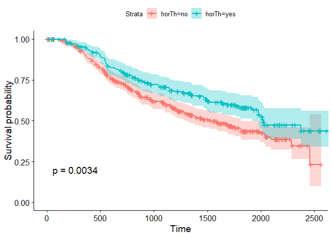<!-- -->

##Obtención de curvas de supervivencia

A continuación vamos a ver como afectan a los resultados agrupar a los pacientes de diferentes formas.

- En función de la edad. Para ello agruparemos las diferentes edades en 3 grupos (0-25, 25-50 y +50). 
- En función del grado. Haciendo dos únicos grupos (grado = 1, grado = 2 y 3).
- En función del número de nodos. En este caso dividiremos entre los que tengan 0 nodos y el resto (Si encontramos pacientes con 0 nodos). Y en otro caso estudiaremos para 3 grupos (1-3, 3-5, >5).


###Agrupamos los diferentes datos

Vamos a empezar generando los diferentes data sets para este estudio. Como se muestra a continuación.


```r
data.edad.group<-GBSG2
data.edad.group$age<-label.edad <- cut(as.numeric(data.edad.group$age), breaks = c(0,30,50,100))
```

De esta forma vamos a agrupar las variabels para cada data.frame, según se ha descrito anteriormente. Esto lo vamos a poder hacer para todos los casos excepto:

```r
# Agrupamos numero de nodos

label.nodos.binary<- c()

nodos<-0
for( i in 1:length(GBSG2$age)){
  if(GBSG2$pnodes[i]==nodos){
    label.nodos.binary<-c(label.nodos.binary,"0")
  }else{
    label.nodos.binary<-c(label.nodos.binary,"REST")
  }
}
table(label.nodos.binary)
```

```
## label.nodos.binary
## REST 
##  686
```
Podemos comprobar que no hay ningún paciente que presente 0 nodos, por lo que vamos a descartar este caso de estudio.


Ajustamos la supervivencia para las variables:

- Recibe tratamiento hormonal
- Grado
- Edad
- Número de nodos


```r
fit.edad<-survfit(Surv(data.edad.group$time, data.edad.group$cens) ~ data.edad.group$age, data=data.edad.group) 
fit.grado<-survfit(Surv(data.grado.group$time, data.grado.group$cens) ~ data.grado.group$tgrade, data=data.grado.group) 
fit.nodos<-survfit(Surv(data.nodes.ranges$time, data.nodes.ranges$cens) ~ data.nodes.ranges$pnodes, data=data.nodes.ranges) 

splots[[2]] <- ggsurvplot(fit.edad, conf.int = TRUE, censor= TRUE, cex.axis=3, cex.lab=3.0, main="Survival curve Age grouping", pval = TRUE)
splots[[3]] <- ggsurvplot(fit.grado, conf.int = TRUE, censor= TRUE, cex.axis=3, cex.lab=3.0, main="Survival curve grade grouping", pval = TRUE)
splots[[4]] <- ggsurvplot(fit.nodos, conf.int = TRUE, censor= TRUE, cex.axis=3, cex.lab=3.0, main="Survival curve nodes grouping", pval = TRUE)

arrange_ggsurvplots(splots, print = TRUE,
  ncol =2, nrow = 2, risk.table.height = 0.5)
```

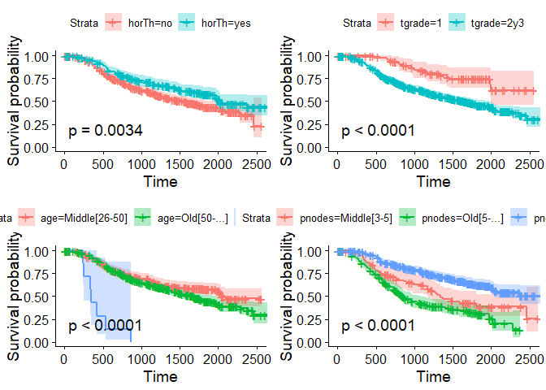<!-- -->

```r
#res <- arrange_ggsurvplots(splots, print = FALSE)
#ggsave("data_grouping.pdf", res)
```

A partir de los resultados obtenidos podemos observar que:

- Las pacientes que han recibido terapias hormonales tienen una esperanza significativamente mayor de supervivencia que las que no.
- Las pacientes que presentan un grado 2 o 3 tienen una esperanza significativamente menor de supervivencia que las que presentan un grado 1.
- Las pacientes presentan una mayor esperanza de supervivencia conforme menos número de nodos presenten.
- La supervivencia de las pacientes que son diagnosticadas en edades muy tempranas (antes de 26 años) presentan una esperanza de supervivencia mucho menor que el resto de edades (más de 26 años).


###Estratificación de edad

Como extensión a esta primera parte del trabajo, me ha parecido interesante intentar encontrar las barreras de edad que generen grupos mas diferenciados.

Como el p-valor no se puede aplicar directamente sobre las 3 cruvas que quiero tratar, he pensado que una buena alternativa sería ver los p-valores para las diferentes combinaciones de las curvas y tratar de buscar el menor valor en conjunto para todas ellas. Para ello he ideado las siguientes funciones:


```r
# Con esta función vamos a partir los datos de edad sobre una edad dada y nos devuelve el p-valor para la comparación de la curva 1 a 1.
probar.variable<-function(data, bound, column.name ){
  new.data<-data.frame()
  new.data.1<-data.frame()
  new.data.2<-data.frame()
  new.data.3<-data.frame()
  label.edad<- c()
  edad1<-bound[1]
  edad2<-bound[2]
  for( i in 1:length(data[,1])){
    if(eval(parse(text = (paste(deparse(substitute(data)), column.name, sep="$"))))[i]<=edad1){
      label.edad<-c(label.edad,"Young[0-25]")
    }
    if(eval(parse(text = (paste(deparse(substitute(data)), column.name, sep="$"))))[i]>edad1 && eval(parse(text = (paste(deparse(substitute(data)), column.name, sep="$"))))[i]<edad2){
      label.edad<-c(label.edad,"Middle[26-50]")
    }
    if(eval(parse(text = (paste(deparse(substitute(data)), column.name, sep="$"))))[i]>=edad2){
      label.edad<-c(label.edad,"Old[50-...]")
    }
  }
  new.data<-GBSG2
  new.data$age<-label.edad
  
  # Ahora tenemos el data frame con los datos correctos. Pasamos a generar 3 data frames.
  new.data.1<-new.data[new.data$age!="Young[0-25]",]
  new.data.2<-new.data[new.data$age!="Middle[26-50]",]
  new.data.3<-new.data[new.data$age!="Old[50-...]",]
  fit1<-survfit(Surv(time,cens) ~ age, data=new.data.1)
  alt1<-surv_pvalue(fit1, data=new.data.1)
  fit2<-survfit(Surv(time,cens) ~ age, data=new.data.2)
  alt2<-surv_pvalue(fit2, data=new.data.2)
  fit3<-survfit(Surv(time,cens) ~ age, data=new.data.3)
  alt3<-surv_pvalue(fit3, data=new.data.3)
  return(c(alt1$pval, alt2$pval, alt3$pval))
}

probar.variable(GBSG2,c(30,50), "age")

# 1st --> Middle & Old
# 2nd --> Young & Old
# 3rd --> Young & Middle

# Tienen que ir cambiando las edades de 1 en 1
minimiza.pval<-function( init.bound, data, column.name){
  val<-probar.variable(data,init.bound, column.name)
  val1<-probar.variable(data,c(init.bound[1]+1,init.bound[2]), column.name)
  val2<-probar.variable(data,c(init.bound[1],init.bound[2]-1), column.name)
  if(sum(val)>=sum(val1) && sum(val)>=sum(val2) ){
    init.bound[1]<-init.bound[1]+1
    init.bound[2]<-init.bound[2]-1
    minimiza.pval(c(init.bound[1],init.bound[2]), data, column.name)
  }
  else if(sum(val)>=sum(val1) || sum(val)>=sum(val2)){ 
    if(sum(val)>=sum(val1)){
      init.bound[1]<-init.bound[1]+1
      minimiza.pval(c(init.bound[1],init.bound[2]), data, column.name)
    }
    else if(sum(val)>=sum(val2)){
      init.bound[2]<-init.bound[2]-1
      minimiza.pval(c(init.bound[1],init.bound[2]), data, column.name)
    }
  }else if(sum(val)<sum(val1) && sum(val)<sum(val2)){
    final.edad<-c()
    final.val<-c()
    final.edad<-init.bound
    final.val<-val
    return(list(final.edad, final.val))
    break
  }
  
}


aproximacion<-function(data, column, aprox){
  val[[1]][2]<-max(GBSG2$age)
  val[[1]][1]<-min(GBSG2$age)
  res.p.val<-c()
  rango.edad<-c()
  while(((val[[1]][2])-(val[[1]][1]))>5){
    if(aprox=="sup"){
      val<-minimiza.pval(c(val[[1]][1],val[[1]][2]-1), GBSG2, "age")
    }else{
      val<-minimiza.pval(c(val[[1]][1]+1,val[[1]][2]), GBSG2, "age")
    }
    res.p.val<-c(res.p.val,sum(val[[2]]))
    rango.edad<-c(rango.edad, paste(val[[1]][1],val[[1]][2], sep="-"))
  }
  return(data.frame(rango.edad=rango.edad, p.val=res.p.val))
}

data.sup<-aproximacion(GBSG2, "age", "sup")
min(data.inf$p.val)
save(data.sup, data.int, file = "savedData/aproxim.RData")
```


Se han obtenido los siguientes resultados:


```r
ggplot(data=data.sup, aes(x=data.sup$rango.edad, y=data.sup$p.val)) +
  geom_bar(stat="identity", width=0.5)
```

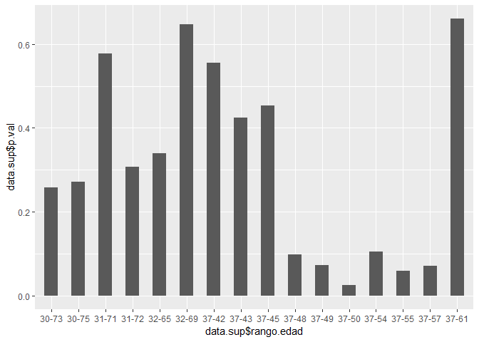<!-- -->


Estos son los rangos para los que se han obtenidos mejores valores sin que se llegasen a entrecruzar. Podemos comprobar los resultados obtenidos y comprobamos que el mejor resultado que obtenemos es para el rango de edades de 37-50 años.


```r
data.sup$p.val[11]
```

```
## [1] 0.02446588
```

Ahora vamos a estratificar la edad para este rango obtenido y ver como influye el cambio de estratificación en la supervivencia.


```r
data.edad.group1<-GBSG2
data.edad.group1$age <- cut(as.numeric(data.edad.group1$age), breaks = c(0,37,50,100))
table(data.edad.group1$age)
```

```
## 
##   (0,37]  (37,50] (50,100] 
##       48      241      397
```
Los datos se encuentrar bien balanceados dentro de los rangos que hemos seleccionado.


```r
fit.edad.opt<-survfit(Surv(data.edad.group1$time, data.edad.group1$cens) ~ data.edad.group1$age, data=data.edad.group1) 
ggsurvplot(fit.edad.opt, conf.int = TRUE, censor= TRUE, cex.axis=3, cex.lab=3.0, main="Survival curve Age grouping", pval = TRUE)
```

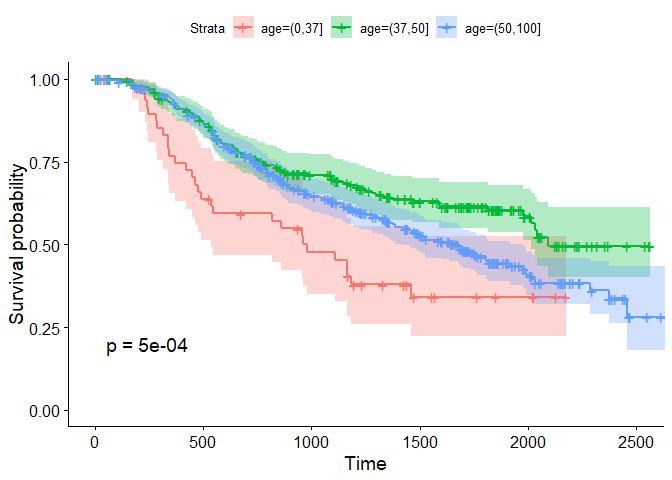<!-- -->


Como habíamos visto anteriormente, las pacientes en las que el cancer ha sido diagnosticado el cancer de mama en una edad muy temprana, la esperanza de supervivencia es mucho menor. Además, a diferencia del resultado obtenido anteriormente, aquí podemos notar que las pacientes de avanzada edad tienen menor esperanza de supervivencia que las que se encuentrar en un rango de edades intermedio. Pese a tener mejor supervivencia (pacientes mayores) que las pacientes mas jóvenes.


###Modelos de riesgo de Cox

Ya que me he centrado anteriormente en la estratificación de la edad, vamos a comprobar a través de los modelos de riesgo proporcionales de Cox, como afecta estas diferentes estratificaciones de los datos a los resultados.


Se ha implementado un algoritmo de búsqueda exhaustiva que devuelve un dataframe con 3 columnas:

- El Pr(>|z|) que genera el modelo
- Formula
- Número de variables usadas


```r
getExhModelVariabCount <- function(data, indep.var){
  formula<-c()
  pvalue<-c()
  names.data <- names(data)
  x.cols <- length(names(data))-2
  indice.matriz <- combos(x.cols)
  num.var<-c()
  
  for(ind in 1:nrow(indice.matriz$binary)){
    ec.pasag <-paste(colnames(data)[indice.matriz$ragged[ind,]])
    
    ec.indep <- indep.var
    ec.final <- as.formula(paste(ec.indep, paste(ec.pasag, collapse="+"), sep=" ~ "))
    cox.data.norm<-coxph(ec.final, data = data)
    cox.zph<-cox.zph(cox.data.norm)
    if(cox.zph$table[nrow(cox.zph$table),][3]>0.05){
      
      formula<-c(formula, as.character(paste(ec.indep, paste(ec.pasag, collapse="+"), sep=" ~ ")))
      num.var<-c(num.var, length(colnames(data)[indice.matriz$ragged[ind,]]))
      pvalue<-c(pvalue,summary(cox.data.norm)$logtest["pvalue"])
    
    }
    
  }
  dat.resul<-data.frame(formula, pvalue, num.var)
  return(dat.resul)
}

df.edad.camb$progrec<-NULL
df.edad.camb$estrec<-NULL
df.edad.norm$progrec<-NULL
df.edad.norm$estrec<-NULL

result.norm <- getExhModelVariabCount(df.edad.norm, "Surv(time,cens)")
result.camb <- getExhModelVariabCount(df.edad.camb, "Surv(time,cens)")
```

De esta forma ya tenemos almacenadas todas las posibles combinaciones de variables que cumplen la proporcionalidad de riesgos. De este set de datos es del que vamos a partir para analizar los datos.

####Análisis univariante

Vamos a empezar realizando el análisis univariante para las diferentes variables que tenemos en nuestro set de datos. Todas aquellas variables que cumplen la proporcionalidad de riesgo son :


```r
formulas.norm<- result.norm$formula[result.norm$num.var==1]
formulas.camb<- result.camb$formula[result.camb$num.var==1]
formulas.norm
```

```
## [1] Surv(time,cens) ~ horTh  Surv(time,cens) ~ age   
## [3] Surv(time,cens) ~ tsize  Surv(time,cens) ~ pnodes
## 47 Levels: Surv(time,cens) ~ age ... Surv(time,cens) ~ tsize+tgrade+pnodes
```

```r
formulas.camb
```

```
## [1] Surv(time,cens) ~ horTh  Surv(time,cens) ~ tsize 
## [3] Surv(time,cens) ~ pnodes
## 34 Levels: Surv(time,cens) ~ age+menostat ...
```

Podemos notar en estos resultados dos cosas importantes:

- Las variables que cumplen la regla de proporcionalidad en ambos sets de datos son iguales.  [p>0.05]
- Tenemos menos niveles en los datos re-estratificados que en los datos sin re-estratificar. Al re-estratificar los datos, se han perdido en torno a unas 13 combinaciones de variables por no cumplir las reglas de proporcionalidad.

Pasamos a estudiar las variables una a una:


```r
cox.data.uni.norm.hor<-coxph(Surv(time, cens) ~ horTh , data = df.edad.norm)
cox.data.uni.norm.age<-coxph(Surv(time, cens) ~ age , data = df.edad.norm)
cox.data.uni.norm.siz<-coxph(Surv(time, cens) ~ tsize , data = df.edad.norm)
cox.data.uni.norm.num<-coxph(Surv(time, cens) ~ pnodes, data = df.edad.norm)

cox.data.uni.camb.hor<-coxph(Surv(time, cens) ~ horTh, data = df.edad.camb)
cox.data.uni.camb.age<-coxph(Surv(time, cens) ~ age, data = df.edad.camb)
cox.data.uni.camb.siz<-coxph(Surv(time, cens) ~ tsize, data = df.edad.camb)
cox.data.uni.camb.num<-coxph(Surv(time, cens) ~ pnodes, data = df.edad.camb)
```

Sabemos que para todas las variables vamos a tener los mismos resultados en los datos estratificados y sin estratificar excepto en edad.

Empezamos por edad:


```r
cox.data.uni.norm.age
```

```
## Call:
## coxph(formula = Surv(time, cens) ~ age, data = df.edad.norm)
## 
##                  coef exp(coef) se(coef)     z        p
## ageOld[50-...] 0.2212    1.2475   0.1238 1.787   0.0739
## ageYoung[0-25] 2.2604    9.5865   0.3965 5.701 1.19e-08
## 
## Likelihood ratio test=20.32  on 2 df, p=3.868e-05
## n= 686, number of events= 299
```

```r
cox.data.uni.camb.age
```

```
## Call:
## coxph(formula = Surv(time, cens) ~ age, data = df.edad.camb)
## 
##                coef exp(coef) se(coef)      z        p
## age(37,50]  -0.8080    0.4458   0.2154 -3.750 0.000177
## age(50,100] -0.5004    0.6063   0.2000 -2.502 0.012355
## 
## Likelihood ratio test=13.9  on 2 df, p=0.0009599
## n= 686, number of events= 299
```

Que información sacamos de aquí:

- La importancia que presenta el nivel de edades mas jóven supera significativamente al del resto, para ambos casos. Como muestran los coeficientes beta.
- Podemos ver un incremento muy grande del riesgo en el nivel de edades jóvenes, lo que indica que para este intervalo de edades la esperanza de supervivencia desciende considerablemente.
- El likelihood ratio que ofrecen los datos que no han sido re-estratificados es significativamente mas bueno que el de los datos que sí.
- Vemos que los coeficientes betas se encuentran mucho mas equilibrados para los datos re-estratificados que los que no. 

Pasamos a estudiar los resultados para el resto de variables.


```r
cox.data.uni.norm.hor
```

```
## Call:
## coxph(formula = Surv(time, cens) ~ horTh, data = df.edad.norm)
## 
##             coef exp(coef) se(coef)      z      p
## horThyes -0.3640    0.6949   0.1250 -2.911 0.0036
## 
## Likelihood ratio test=8.82  on 1 df, p=0.002977
## n= 686, number of events= 299
```

```r
cox.data.uni.norm.num
```

```
## Call:
## coxph(formula = Surv(time, cens) ~ pnodes, data = df.edad.norm)
## 
##                      coef exp(coef) se(coef)      z        p
## pnodesOld[5-...]   0.4182    1.5192   0.1662  2.516   0.0119
## pnodesSmall [0-3] -0.6672    0.5132   0.1675 -3.982 6.83e-05
## 
## Likelihood ratio test=71.7  on 2 df, p=2.696e-16
## n= 686, number of events= 299
```

```r
cox.data.uni.norm.siz
```

```
## Call:
## coxph(formula = Surv(time, cens) ~ tsize, data = df.edad.norm)
## 
##                 coef exp(coef) se(coef)     z      p
## tsize(25,50]  0.2607    1.2979   0.1226 2.126 0.0335
## tsize(50,75]  0.5545    1.7410   0.2300 2.411 0.0159
## tsize(75,100] 0.9007    2.4614   0.3875 2.324 0.0201
## 
## Likelihood ratio test=11.03  on 3 df, p=0.01156
## n= 685, number of events= 298 
##    (1 observation deleted due to missingness)
```

Vamos a comentar las diferentes variables una a una.

**Hormonoterapia *hotTh***

- Podemos ver que el nivel de horTh = Yes frente a horTh= No vemos que se reduce el riesgo.
- Para horTh = Yes, tenemos un incremento del riesgo rescpecto a horTh = No de 0.6.

**Tamaño del tumo (tsize)**

- Conforme aumenta el tamaño del tumor aumenta el riesgo asociado. Como era de esperar. 
- Vemos que todos los niveles resultan significativos. Y conforme mas alejado del inicial mas aumenta su significancia


**Número de nodos (pnodes)**
- Vemo que conforme aumenta el número de nodos, aumenta la significancia, además del riesgo asociado.


####Análisis multivariante

Ya habíamos calculado anteriomente todos los modelos que cumplían las reglas de proporcionalidad.

Pasamos a ver para cada número de variables que fórmula arroja los mejores resultados.

Esto podemos hacerlo de una forma rápida así:


```r
lista.norm<-sapply(1:max(result.norm$num.var), function(x)
    list(toString(result.norm[result.norm$num.var==x,][which.min(result.norm[result.norm$num.var==x,]$pvalue),]$formula ),
      result.norm[result.norm$num.var==x,][which.min(result.norm[result.norm$num.var==x,]$pvalue),]$pvalue ,x)  )


lista.camb<-sapply(1:max(result.camb$num.var), function(x)
    list(toString(result.camb[result.camb$num.var==x,][which.min(result.camb[result.camb$num.var==x,]$pvalue),]$formula ),
      result.camb[result.camb$num.var==x,][which.min(result.camb[result.camb$num.var==x,]$pvalue),]$pvalue , x) )

lista.norm<-t(lista.norm)
lista.camb<-t(lista.camb)


kable(lista.norm)%>%
      kable_styling(bootstrap_options = "striped", full_width = F)
```

<table class="table table-striped" style="width: auto !important; margin-left: auto; margin-right: auto;">
<tbody>
  <tr>
   <td style="text-align:left;"> Surv(time,cens) ~ pnodes </td>
   <td style="text-align:left;"> 2.6957625639193e-16 </td>
   <td style="text-align:left;"> 1 </td>
  </tr>
  <tr>
   <td style="text-align:left;"> Surv(time,cens) ~ age+pnodes </td>
   <td style="text-align:left;"> 1.30639695616913e-19 </td>
   <td style="text-align:left;"> 2 </td>
  </tr>
  <tr>
   <td style="text-align:left;"> Surv(time,cens) ~ horTh+age+pnodes </td>
   <td style="text-align:left;"> 1.04929667755562e-21 </td>
   <td style="text-align:left;"> 3 </td>
  </tr>
  <tr>
   <td style="text-align:left;"> Surv(time,cens) ~ horTh+age+tgrade+pnodes </td>
   <td style="text-align:left;"> 1.84182210760811e-23 </td>
   <td style="text-align:left;"> 4 </td>
  </tr>
  <tr>
   <td style="text-align:left;"> Surv(time,cens) ~ horTh+age+menostat+tgrade+pnodes </td>
   <td style="text-align:left;"> 4.53820860476281e-23 </td>
   <td style="text-align:left;"> 5 </td>
  </tr>
  <tr>
   <td style="text-align:left;"> Surv(time,cens) ~ horTh+age+menostat+tsize+tgrade+pnodes </td>
   <td style="text-align:left;"> 2.48658308908699e-21 </td>
   <td style="text-align:left;"> 6 </td>
  </tr>
</tbody>
</table>

```r
kable(lista.camb)%>%
      kable_styling(bootstrap_options = "striped", full_width = F)
```

<table class="table table-striped" style="width: auto !important; margin-left: auto; margin-right: auto;">
<tbody>
  <tr>
   <td style="text-align:left;"> Surv(time,cens) ~ pnodes </td>
   <td style="text-align:left;"> 2.6957625639193e-16 </td>
   <td style="text-align:left;"> 1 </td>
  </tr>
  <tr>
   <td style="text-align:left;"> Surv(time,cens) ~ horTh+pnodes </td>
   <td style="text-align:left;"> 5.88152062163532e-18 </td>
   <td style="text-align:left;"> 2 </td>
  </tr>
  <tr>
   <td style="text-align:left;"> Surv(time,cens) ~ horTh+age+pnodes </td>
   <td style="text-align:left;"> 2.40546856015502e-20 </td>
   <td style="text-align:left;"> 3 </td>
  </tr>
  <tr>
   <td style="text-align:left;"> Surv(time,cens) ~ horTh+age+menostat+pnodes </td>
   <td style="text-align:left;"> 8.82069255426482e-20 </td>
   <td style="text-align:left;"> 4 </td>
  </tr>
  <tr>
   <td style="text-align:left;"> Surv(time,cens) ~ horTh+age+menostat+tsize+pnodes </td>
   <td style="text-align:left;"> 4.66992543303426e-18 </td>
   <td style="text-align:left;"> 5 </td>
  </tr>
  <tr>
   <td style="text-align:left;"> Surv(time,cens) ~ horTh+age+menostat+tsize+tgrade+pnodes </td>
   <td style="text-align:left;"> 1.59311847815189e-19 </td>
   <td style="text-align:left;"> 6 </td>
  </tr>
</tbody>
</table>

En primer lugar, se ve que la forma en la que se van apareciendo las variables en las fórmulas, está muy relacionada con la importancia de las variables que hemos comentado anteriormente, como es de esperar. Vemos ligeras diferencias en el orden en el que aparecen entre los datos estratificados y sin re-estratificar. Estas son ocasionadas por la diferencias de estratificación en la variable edad.

Para los datos sin estratificar, podemos apreciar claramente que a partir de 4 variables, no encontramos un aumento en el pvalor. Es decir, la fórmula *Surv(time,cens)~ horTh + age + tgrade + pnodes* es capaz de aproximar la curva mejor que la fólmula que contiene todas las variables *Surv(time,cens)~ horTh + age + menostat + tSize + tgrade + pnodes*. 

En cambio para los datos que han sido estratificados a partir de 3 variables vemos que no hay un aumento importante del likelihood ratio. Las variables *Surv(time,cens)~ horTh + age + pnodes* dan un likelihood ratio practicamente igual que la que ofrecen todas las variables juntas.

Parece bastante lógico pensar que a la hora de diagnosticar el riesgo en cancer de mama las variables con mas importancia sean:

- El tratamiento: Hormonoterapia
- La edad: age
- El número de nodos: pnodes


#TCGA

Continuamos este trabajo analizando los resultados de supervivencia para los datos que podemos encontrar en la base de datos **TCGA**, sobre *Breast cancer*.

##Procesamiento de datos
###Recogida de datos
Para traer los datos vamos a utilizar las funcionalidades que ofrece el paquete *library(TCGAretriever)*.


```r
cdat.tcga<-get_clinical_data("brca_tcga_all")
```
Este es el estudio que hemos elegido, del cual seleccionaremos exclusivamente ciertas variables. Como mínimo vamos a necesitar:

- Estado menopausico
- Número de nodos (Para estratificar en torno a ellos)
- Determinar fenotipo del cancer

```r
cdat.tcga.select<-subset(cdat.tcga, select = c(CASE_ID, AGE, AJCC_PATHOLOGIC_TUMOR_STAGE,AJCC_TUMOR_PATHOLOGIC_PT , MENOPAUSE_STATUS, LYMPH_NODES_EXAMINED_HE_COUNT, LYMPH_NODES_EXAMINED_IHC_COUNT,  IHC_HER2, ER_STATUS_BY_IHC, PR_STATUS_BY_IHC, OS_MONTHS, OS_STATUS))
```

###Reorganizamos los datos

Vamos a procesar los datos de dos formas diferentes para ver en que medida la forma de tratar los datos está afectando a nuestro experimento. En primer lugar, eliminaremos los datos dudosos. En segundo lugar, rellenaremos los datos dudosos o vacíos con la media/moda.

####Truncamos datos

```r
df<-cdat.tcga.select
# Quitamos valores de tiempo negativos
df<-df[df$OS_MONTHS>=0,]
df$OS_MONTHS<-as.numeric(df$OS_MONTHS)
df$OS_STATUS<-as.numeric(as.factor(df$OS_STATUS))

df<-df[!(df$IHC_HER2 %in% c("Indeterminate","Equivocal","")),]
df<-df[!(df$ER_STATUS_BY_IHC %in% c("Indeterminate","Equivocal","")),]
df<-df[!(df$PR_STATUS_BY_IHC %in% c("Indeterminate","Equivocal","")),]

# Ahora pasamos a procesar el resto de columnas que hemos seleccionado
 comprueba.fenotipo<-function(data, i){
   vect<-c()
   if(data$IHC_HER2[i]=="Positive"){
     vect<-c(vect, "HER2")
   }else if(data$IHC_HER2[i]=="Negative" && data$ER_STATUS_BY_IHC[i]=="Negative" && data$PR_STATUS_BY_IHC[i]=="Negative"){
     vect<-c(vect, "3Negative")
   }else{
     vect<-c(vect, "luminal")
   }
   return(vect)
 }
 
vect<-unlist(lapply(1:length(df$CASE_ID),function(i) comprueba.fenotipo(data=df,i)))
data.inc.phen<-cbind(df,Pheno=vect)

data.inc.phen$AGE<-as.numeric(data.inc.phen$AGE)
data.inc.phen$LYMPH_NODES_EXAMINED_HE_COUNT<-as.numeric(data.inc.phen$LYMPH_NODES_EXAMINED_HE_COUNT)

data.inc.phen<-data.inc.phen[!(data.inc.phen$LYMPH_NODES_EXAMINED_HE_COUNT %in% c("")),]
data.inc.phen$LYMPH_NODES_EXAMINED_HE_COUNT<-as.numeric(data.inc.phen$LYMPH_NODES_EXAMINED_HE_COUNT)

data.inc.phen$MENOPAUSE_STATUS<-factor(data.inc.phen$MENOPAUSE_STATUS)
levels(data.inc.phen$MENOPAUSE_STATUS) <- c('1', '2', '3','Post' , 'Pre')
data.inc.phen<-data.inc.phen[!(data.inc.phen$MENOPAUSE_STATUS %in% c("1","2","3")),]

# Renombramos columnas del data.frame
names(data.inc.phen)<-c('ID', 'age', 'tumorState', 'pathologicPT', 'menostat', 'nodesHE', 'nodesIHC', 'HER2','ER','PR', 'time','cens','Pheno')
#data.truc <- data.inc.phen [ , c(1:8,11,9,10)]
data.trunc<-data.inc.phen
```

####Rellenamos datos


```r
df<-cdat.tcga.select
# Quitamos valores de tiempo negativos
df<-df[df$OS_MONTHS>=0,]
df$OS_MONTHS<-as.numeric(df$OS_MONTHS)
df$OS_STATUS<-as.numeric(as.factor(df$OS_STATUS))

df$IHC_HER2[df$IHC_HER2!="Positive"]<-"Negative"
df$ER_STATUS_BY_IHC[df$ER_STATUS_BY_IHC!="Positive"]<-"Negative"
df$PR_STATUS_BY_IHC[df$PR_STATUS_BY_IHC!="Positive"]<-"Negative"

# Ahora pasamos a procesar el resto de columnas que hemos seleccionado
 comprueba.fenotipo<-function(data, i){
   vect<-c()
   if(data$IHC_HER2[i]=="Positive"){
     vect<-c(vect, "HER2")
   }else if(data$IHC_HER2[i]=="Negative" && data$ER_STATUS_BY_IHC[i]=="Negative" && data$PR_STATUS_BY_IHC[i]=="Negative"){
     vect<-c(vect, "3Negative")
   }else{
     vect<-c(vect, "luminal")
   }
   return(vect)
 }
 
vect<-unlist(lapply(1:length(df$CASE_ID),function(i) comprueba.fenotipo(data=df,i)))
data.inc.phen<-cbind(df,Pheno=vect)

data.inc.phen$AGE<-as.numeric(data.inc.phen$AGE)
data.inc.phen$LYMPH_NODES_EXAMINED_HE_COUNT<-as.numeric(data.inc.phen$LYMPH_NODES_EXAMINED_HE_COUNT)
data.inc.phen$LYMPH_NODES_EXAMINED_HE_COUNT<-replace(data.inc.phen$LYMPH_NODES_EXAMINED_HE_COUNT, is.na(data.inc.phen$LYMPH_NODES_EXAMINED_HE_COUNT), round(mean(data.inc.phen$LYMPH_NODES_EXAMINED_HE_COUNT, na.rm=TRUE)))

data.inc.phen$LYMPH_NODES_EXAMINED_IHC_COUNT<-as.numeric(data.inc.phen$LYMPH_NODES_EXAMINED_IHC_COUNT)
data.inc.phen$LYMPH_NODES_EXAMINED_IHC_COUNT<-replace(data.inc.phen$LYMPH_NODES_EXAMINED_IHC_COUNT, is.na(data.inc.phen$LYMPH_NODES_EXAMINED_IHC_COUNT), round(mean(data.inc.phen$LYMPH_NODES_EXAMINED_IHC_COUNT, na.rm=TRUE)))

data.inc.phen$MENOPAUSE_STATUS<-factor(data.inc.phen$MENOPAUSE_STATUS)
levels(data.inc.phen$MENOPAUSE_STATUS) <- c('1', '2', '3','Post' , 'Pre')
data.inc.phen$MENOPAUSE_STATUS<-fct_collapse(data.inc.phen$MENOPAUSE_STATUS, POST = c("1","2","3","Post"), PRE = c("Pre"))
# Renombramos columnas del data.frame
names(data.inc.phen)<-c('ID', 'age', 'tumorState', 'pathologicPT', 'menostat', 'nodesHE', 'nodesIHC', 'HER2','ER','PR', 'time','cens','Pheno')
data.fill<-data.inc.phen
```


Las dimensiones de cada dataframe obtenido los las siguientes:

```r
dim(data.trunc)
```

```
## [1] 637  13
```

```r
dim(data.fill)
```

```
## [1] 1101   13
```
Se aprecia que al eliminar los pacientes que no tenían información apropiada llegamos a quedarnos aproximadamente con la mitad de pacientes en total.


##Analisis de supervivencia

En esta parte vamos a realizar los análisis de supervivencia para las variables propuestas en clase.

- Estado menopausico
- Número de nodos (1-3, 3-5, >5)
- Determinar fenotipo del cancer

Además, también quiero comprobar la edad.

En primer lugar vamos a empezar estratificando los datos.


```r
data.fill$nodesIHC<-cut(as.numeric(data.fill$nodesIHC), breaks = c(0,3,5,100))  
data.fill$nodesHE<-cut(as.numeric(data.fill$nodesHE), breaks = c(0,3,5,100))
data.trunc$nodesHE<-cut(as.numeric(data.trunc$nodesIHC), breaks = c(0,3,5,100))  
data.trunc$nodesIHC<-cut(as.numeric(data.trunc$nodesHE), breaks = c(0,3,5,100))  
```

Una vez tenemos preparados los datos, ya podemos realizar el análisis de supervivencia.

```r
fit.grado.fill<-survfit(Surv(data.fill$time, data.fill$cens) ~ data.fill$menostat, data=data.fill) 
fit.grado.trunc<-survfit(Surv(data.trunc$time, data.trunc$cens) ~ data.trunc$menostat, data=data.trunc) 

fit.nodos.IHC.fill<-survfit(Surv(data.fill$time, data.fill$cens) ~ data.fill$nodesIHC, data=data.fill) 
fit.nodos.IHC.trunc<-survfit(Surv(data.trunc$time, data.trunc$cens) ~ data.trunc$nodesIHC, data=data.trunc) 

fit.nodos.HE.fill<-survfit(Surv(data.fill$time, data.fill$cens) ~ data.fill$nodesHE, data=data.fill) 
fit.nodos.HE.trunc<-survfit(Surv(data.trunc$time, data.trunc$cens) ~ data.trunc$nodesHE, data=data.trunc) 

fit.pheno.fill<-survfit(Surv(data.fill$time, data.fill$cens) ~ data.fill$Pheno, data=data.fill) 
fit.pheno.trunc<-survfit(Surv(data.trunc$time, data.trunc$cens) ~ data.trunc$Pheno, data=data.trunc) 
```


```r
splots<-list()

splots[[1]] <- ggsurvplot(fit.grado.fill, conf.int = TRUE, censor= TRUE, cex.axis=3, cex.lab=3.0, main="Menop Filled data", pval = TRUE)
splots[[2]] <- ggsurvplot(fit.grado.trunc, conf.int = TRUE, censor= TRUE, cex.axis=3, cex.lab=3.0, main="Menop Trunc data", pval = TRUE)
splots[[3]] <- ggsurvplot(fit.pheno.fill, conf.int = TRUE, censor= TRUE, cex.axis=3, cex.lab=3.0, main="Pheno Filled data", pval = TRUE)
splots[[4]] <- ggsurvplot(fit.pheno.trunc, conf.int = TRUE, censor= TRUE, cex.axis=3, cex.lab=3.0, main="Pheno Trunc data", pval = TRUE)

arrange_ggsurvplots(splots, print = TRUE, ncol =2, nrow = 2)
```

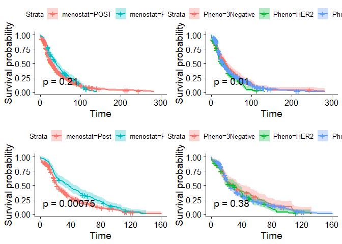<!-- -->


Aquí tenemos las curvas de supervivencia obtenidas para la menopausia y para el fenotipo. Arriba encontramos las curvas de supervivencia para los datos que hemos rellenado y abajo para los datos truncados.

En la imagen podemos apreciar, que para los datos truncados, las pacientes postmenopáusicas presentan una supervivencia mucho peor que las pacientes premenopáusicas. En cambio, para los datos rellenados no encontramos una diferencia significativa entre ambas curvas de supervivencia.

Los resultados que ofrece el fenotipo no llega a ser suficientemente significativa para ninguno de los dos casos.


```r
plot_nodos<-list()

plot_nodos[[1]] <- ggsurvplot(fit.nodos.IHC.fill, censor= TRUE, cex.axis=3, cex.lab=3.0, main="Pheno Filled data", pval = TRUE)
plot_nodos[[2]] <- ggsurvplot(fit.nodos.IHC.trunc, conf.int = TRUE, censor= TRUE, cex.axis=3, cex.lab=3.0, main="Pheno Trunc data", pval = TRUE)
```

```
## Warning in .pvalue(fit, data = data, method = method, pval = pval, pval.coord = pval.coord, : There are no survival curves to be compared. 
##  This is a null model.
```

```r
plot_nodos[[3]] <- ggsurvplot(fit.nodos.HE.fill, censor= TRUE, cex.axis=3, cex.lab=3.0, main="Pheno Filled data", pval = TRUE)
plot_nodos[[4]] <- ggsurvplot(fit.nodos.HE.trunc, conf.int = TRUE, censor= TRUE, cex.axis=3, cex.lab=3.0, main="Pheno Trunc data", pval = TRUE)

arrange_ggsurvplots(plot_nodos, print = TRUE, ncol =2, nrow = 2, risk.table.height = 0.5)
```

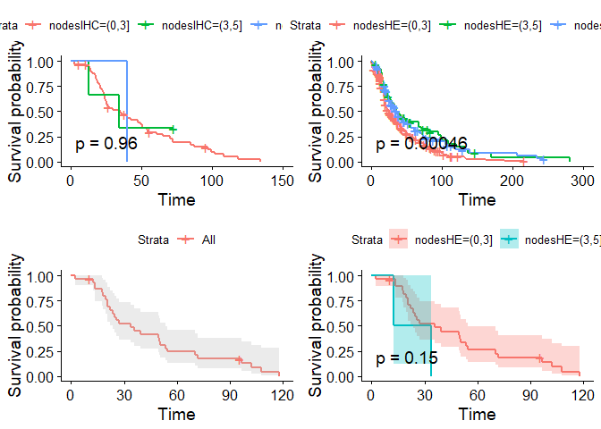<!-- -->

En base al p-value, podemos ver que el conteo de nódulos mediante IHC nos aporta poca información y aunque el conteo de nódulos mediante HE nos aporta algo mas de información, tampoco mucha. Desde luego ofrecen mucha menos diferenciación entre las curvas de supervivencia que la que ofrecen otras variables como el estado menopáusico.

Vemos una clara diferencia en el eje x de los datos truncados y de los datos rellenados, se reduce casi a la mitad. 

#####**¿Aquí podría deberse esto?**

Esto podría indicar que los pacientes que han tenido un seguimiento mas largo no tienen realizadas ciertas pruebas que hemos filtrado. Y al encontrar datos vacíos los hemos truncado. Eso hace pensar que alguno de los parámetros que estamos utilizando son indicadores que se han empezado a utilizar recientemente. 

O que simplemente, algunas de las variables que hemos seleccionado no sea muy utilizada. 

##Elección de la variable Nodos


```r
fd<-cdat.tcga.select
max.list<-lapply(1:ncol(fd), function(x) nrow(fd[(fd[,x] %in% c("")),]))
max1<-colnames(fd)[which.max(max.list)]
fd<-fd[,-which.max(max.list)]
max.list.2<-lapply(1:ncol(fd), function(x) nrow(fd[(fd[,x] %in% c("")),]))
max2<-colnames(fd)[which.max(max.list.2)]
fd<-fd[,-which.max(max.list.2)]
max.list.3<-lapply(1:ncol(fd), function(x) nrow(fd[(fd[,x] %in% c("")),]))
max3<-colnames(fd)[which.max(max.list.3)]
cat(max1,"\n",max2,"\n",max3)
```

```
## LYMPH_NODES_EXAMINED_IHC_COUNT 
##  IHC_HER2 
##  LYMPH_NODES_EXAMINED_HE_COUNT
```


Podemos ver que los procedimientos de IHC son los menos utilizados.

Las pruebas que tratan de contar el número de nodos encabezan la lista, tenemos en primer y en tercer lugar el conteo de nodos mediante una tecnica inmunohistoquímica cuantitativa (IHC), y mediante un probeso de tinción (HE: hematoxylin and eosin) respectivamente. Esto es muy curioso puesto que si buscamos en la literatura podemos encontrar que el número de nodos supone un factor muy importante a la hora de poder predecir si un paciente puede recaer.

También podemos destacar la aparición del IHC_HER2, que hoy en día es un factor muy importante de cancer de mama.

El gen HER2 y la sobreexpresión de la proteína de HER2 provoca una transformación celular. Se ha observado que ocurre este fenómeno entre un 10% y un 40% en casos de cancer de mama humano. La sobreexpresión de HER2 nos permite asociar la respuesta, pronóstico y agresividad del cancer frenter a agentes hormonales y citotóxicos en los pacientes de cancer de mama. Todo esto indica que HER2 es un diana apropiada para terapias específicas para tumores.

Podemos concluir que los datos vacíos ocurren principalmente por la técnica utilizada (IHC), mas que por la propia variable que se quiere estudiar. 

La razón mas plausible por la que podría estar ocurriendo esto (encontrar tantos datos vacíos en esta variable) es porque para la mayoría de casos no se necesite utilizar esta técnica, y solo se use en algunas situaciones por ejemplo. Sobre todo en el caso de el conteo de nodos mediante IHC. Pasamos a comprobarlo.


```r
cdat.fecha<-subset(cdat.tcga, select =  FORM_COMPLETION_DATE  )
fd<-cbind(cdat.tcga.select, cdat.fecha)
fd<-fd[fd$OS_MONTHS>=0,]
fd$OS_MONTHS<-as.numeric(fd$OS_MONTHS)

date<-gsub("/", "-", fd$FORM_COMPLETION_DATE)
fd$FORM_COMPLETION_DATE<-date
fd$FORM_COMPLETION_DATE<-parse_date_time(fd$FORM_COMPLETION_DATE, "dmy")

rt<-fd[(fd[,"LYMPH_NODES_EXAMINED_IHC_COUNT"] %in% c("")),]
m1<-mean(rt$OS_MONTHS)
s<-sum(rt$OS_MONTHS)
p<-qplot(rt$OS_MONTHS)
rt1<-fd[(fd[,"IHC_HER2"] %in% c("")),]
m2<-mean(rt1$OS_MONTHS)
s1<-sum(rt1$OS_MONTHS)
p1<-qplot(rt1$OS_MONTHS)
rt2<-fd[(fd[,"LYMPH_NODES_EXAMINED_HE_COUNT"] %in% c("")),]
m3<-mean(rt2$OS_MONTHS)
s2<-sum(rt2$OS_MONTHS)
p2<-qplot(rt2$OS_MONTHS)

cat(s,s1,s2)
```

```
## 31593.62 11398.03 3725.07
```

```r
cat(m1,m2,m3)
```

```
## 41.7905 64.03388 22.44018
```

```r
grid.arrange(p,p1, p2, nrow = 1)
```

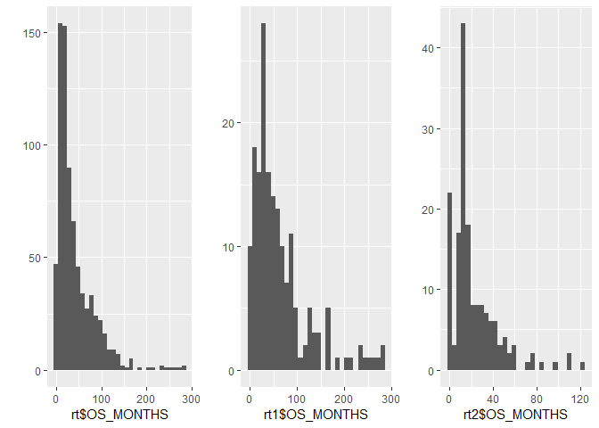<!-- -->
En estas gráficas se muestran los datos que se han eliminado.

Aprovecho estas gráficas para recordar que se nota un pérdida muy grande de datos en los 100 primeros valores para las dos primeras y en los 80 primeros meses para la tercera gráfica. Como sabemos, esto ocurre porque no tenemos una distribución normal de los datos sino que se aglomeran a la izquierda.


```r
kable(rbind(table(year(fd$FORM_COMPLETION_DATE)),
      table(year(rt$FORM_COMPLETION_DATE)),
      c(table(year(rt1$FORM_COMPLETION_DATE)),0),
      c(table(year(rt2$FORM_COMPLETION_DATE)),0))) %>%
      kable_styling(bootstrap_options = "striped", full_width = F)
```

<table class="table table-striped" style="width: auto !important; margin-left: auto; margin-right: auto;">
 <thead>
  <tr>
   <th style="text-align:right;"> 2010 </th>
   <th style="text-align:right;"> 2011 </th>
   <th style="text-align:right;"> 2012 </th>
   <th style="text-align:right;"> 2013 </th>
   <th style="text-align:right;"> 2014 </th>
   <th style="text-align:right;"> 2015 </th>
  </tr>
 </thead>
<tbody>
  <tr>
   <td style="text-align:right;"> 137 </td>
   <td style="text-align:right;"> 216 </td>
   <td style="text-align:right;"> 40 </td>
   <td style="text-align:right;"> 30 </td>
   <td style="text-align:right;"> 10 </td>
   <td style="text-align:right;"> 3 </td>
  </tr>
  <tr>
   <td style="text-align:right;"> 86 </td>
   <td style="text-align:right;"> 179 </td>
   <td style="text-align:right;"> 24 </td>
   <td style="text-align:right;"> 17 </td>
   <td style="text-align:right;"> 7 </td>
   <td style="text-align:right;"> 1 </td>
  </tr>
  <tr>
   <td style="text-align:right;"> 39 </td>
   <td style="text-align:right;"> 30 </td>
   <td style="text-align:right;"> 8 </td>
   <td style="text-align:right;"> 7 </td>
   <td style="text-align:right;"> 1 </td>
   <td style="text-align:right;"> 0 </td>
  </tr>
  <tr>
   <td style="text-align:right;"> 5 </td>
   <td style="text-align:right;"> 16 </td>
   <td style="text-align:right;"> 3 </td>
   <td style="text-align:right;"> 5 </td>
   <td style="text-align:right;"> 2 </td>
   <td style="text-align:right;"> 0 </td>
  </tr>
</tbody>
</table>

En estas tablas encontramos representadas la cantidad de pacientes eliminados por tener datos vacíos para cada una de las variables que hemos obtenido anteriormente.

En la primera fila tenemos todos los pacientes para los que hemos filtrados los datos y tenían anotadas las fechas, aunque no sea de forma exacta, nos da una idea bastante representativa sobre el conjunto de pacientes.

En la primera fila se pierden una grán cantidad de datos de una forma proporcional a los pacientes que teníamos para cada año. Esto refuerza nuestra hipótesis de que esta prueba se usa de forma excepcional, para corroborar algunos de los resultados que hemos obtenido mediante otra aproximación y que resulta dudoso. Aunque menos, para HE también estamos perdiendo una cantidad considerable de datos, lo que me hace pensar que la variable en la que se almacenan el conjunto de nodos contados no sea ninguna de estas.

Efectivamente, al buscar la variable para contar los nodos había escrito **nodes**, pero hay otra variable **LYMPH_NODE_EXAMINED_COUNT** en la que están guardados el conteo de nodos final.


  Lo que hice             |  Lo que debería de haber hecho
:-------------------------:|:-------------------------:
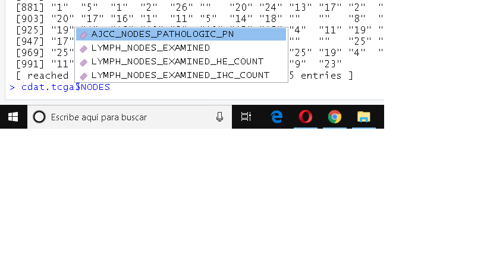  |  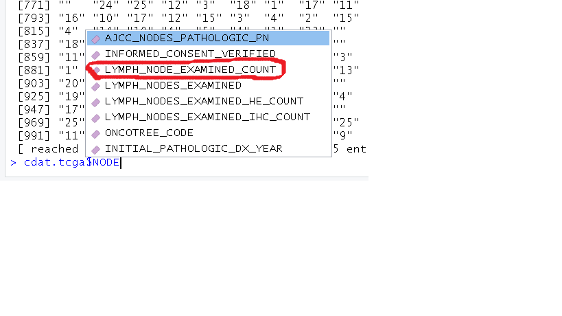


En el segundo caso (la segunda fila) comprobamos que tenemos una situación bastante parecida, aunque esta técnica si que es mas utilizada y el total de valores que elimina es sensiblemente menor.

##Corrección de los sets de datos

Este apartado está exclusivamente dedicado a corregor los data sets. Para ello voy a repetir todo lo que hice anteriormente, pero esta vez utilizando para el conteo de nodos la variable vista anteriormente en vez de el conteo por HE o IHC. Y ver los cambios con lo que teníamos anteriormente.


Volvemos a hacer el análisis de supervivencia:


```r
fit.grado.fill.rev<-survfit(Surv(time,cens) ~ menostat, data=data.reviewed.fill) 
fit.grado.trunc.rev<-survfit(Surv(time, cens) ~ menostat, data=data.reviewed.trunc) 
fit.nodos.COUNT.fill<-survfit(Surv(time, cens) ~ nodesCount, data=data.reviewed.fill) 
fit.nodos.COUNT.trunc<-survfit(Surv(time, cens) ~ nodesCount, data=data.reviewed.trunc)  
fit.pheno.fill.rev<-survfit(Surv(time, cens) ~ Pheno, data=data.reviewed.fill) 
fit.pheno.trunc.rev<-survfit(Surv(time, cens) ~ Pheno, data=data.reviewed.fill) 
```

Vamos a ver las diferencias que tenemos a los resultados anteriores. Recordamos que anteriormente habíamos obtenido para la variable menopausia y Phenotipo los siguientes resultados:

```r
arrange_ggsurvplots(splots, print = TRUE, ncol =2, nrow = 2)
```

<!-- -->


```r
splots.rev<-list()

splots.rev[[1]] <- ggsurvplot(fit.grado.fill.rev, conf.int = TRUE, censor= TRUE, cex.axis=3, cex.lab=3.0, main="Menop Filled data", pval = TRUE)
splots.rev[[2]] <- ggsurvplot(fit.grado.trunc.rev, conf.int = TRUE, censor= TRUE, cex.axis=3, cex.lab=3.0, main="Menop Trunc data", pval = TRUE)
splots.rev[[3]] <- ggsurvplot(fit.pheno.fill.rev, conf.int = TRUE, censor= TRUE, cex.axis=3, cex.lab=3.0, main="Pheno Filled data", pval = TRUE)
splots.rev[[4]] <- ggsurvplot(fit.pheno.trunc.rev, conf.int = TRUE, censor= TRUE, cex.axis=3, cex.lab=3.0, main="Pheno Trunc data", pval = TRUE)

arrange_ggsurvplots(splots, print = TRUE, ncol =2, nrow = 2)
```

<!-- -->

Como podemos apreciar, los cambios son muy poco significativos, de hecho solo encontramos un leve cambio para la variable edad, mientras que el resto se mantiene. Esto tiene mucho sentido porque para el conteo de nodos general se utilizadan tanto el conteo de nodos por ICH como por HE. Por lo que los datos vacíos serán compartidos entre el global y la suma de ambos métodos (ICH y HE).

Y cual es la diferencia entre la supervivencia para cada uno del conteo de nodos visto anteriormente y el global:

```r
fit.nodos.IHC.fill<-survfit(Surv(data.fill$time, data.fill$cens) ~ data.fill$nodesIHC, data=data.fill) 
fit.nodos.IHC.trunc<-survfit(Surv(data.trunc$time, data.trunc$cens) ~ data.trunc$nodesIHC, data=data.trunc) 
fit.nodos.HE.fill<-survfit(Surv(data.fill$time, data.fill$cens) ~ data.fill$nodesHE, data=data.fill) 
fit.nodos.HE.trunc<-survfit(Surv(data.trunc$time, data.trunc$cens) ~ data.trunc$nodesHE, data=data.trunc)
```


```r
plot_nodos.rev<-list()

plot_nodos.rev[[1]] <- ggsurvplot(fit.nodos.IHC.fill, main="ICH FILL", pval = TRUE)
plot_nodos.rev[[2]] <- ggsurvplot(fit.nodos.IHC.trunc, conf.int = TRUE, main="IHC TRUNC", pval = TRUE)
```

```
## Warning in .pvalue(fit, data = data, method = method, pval = pval, pval.coord = pval.coord, : There are no survival curves to be compared. 
##  This is a null model.
```

```r
plot_nodos.rev[[3]] <- ggsurvplot(fit.nodos.HE.fill, main="HE FILL", pval = TRUE)
plot_nodos.rev[[4]] <- ggsurvplot(fit.nodos.HE.trunc, conf.int = TRUE, censor= TRUE, main="HE TRUNC", pval = TRUE)
plot_nodos.rev[[5]] <- ggsurvplot(fit.nodos.COUNT.fill, conf.int = TRUE, main="TOTAL FILL", pval = TRUE)
plot_nodos.rev[[6]] <- ggsurvplot(fit.nodos.COUNT.trunc, conf.int = TRUE, main="TOTAL TRUNC", pval = TRUE)

arrange_ggsurvplots(plot_nodos.rev, print = TRUE, ncol =3, nrow = 2, risk.table.height = 0.5)
```

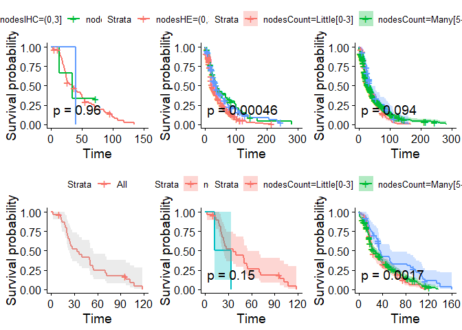<!-- -->


En esta imagen tenemos arria los datos rellenados, y abajo los truncados. Y las curvas de supervivencia para IHC, HE y global (de izquierda a derecha) respectivamente.

Como se esperaba, el resultado que arroja el conteo general es mas parecido al conteo por HE. Además, al utilizar el conteo general, (para datos truncados) la supervivencia para las pacientes que tienen entre 3-5 nodos es significativamente mejor que para el resto de pacientes. 

En general, las pacientes que presentan entre 3-5 nodos son las que tienen mayor esperanza de supervivencia, mientras que las pacientes que presenten menos de tres nodos o mas de cinco, parecen presentar una esperanza de supervivencia muy parecida. 

Para el resto de apartados se utilizarán los set de datos corregidos.

##Combinación de variables

Anteriormente hemos visto que la variable que ofrece mas diferencia entre ambas curvas de supervivencia es **menostat** *(el estado menopausico)*. A continuación vamos a enfrentar **menostat** con las variables restantes y comentaremos los resultados. 


```r
fit_meno_fill<-survfit(Surv(time, cens) ~ menostat, data=data.reviewed.fill) 
fit.meno.trunc<-survfit(Surv(time, cens) ~ menostat, data=data.reviewed.trunc)    
```

Para cada una de las variables veremos a ver que ocurre tanto para los datos filtrados como para los truncados.


```r
ggsurvplot_facet(fit_meno_fill, data.reviewed.fill, facet.by = "Pheno", palette = "Pheno", pval = TRUE)
```

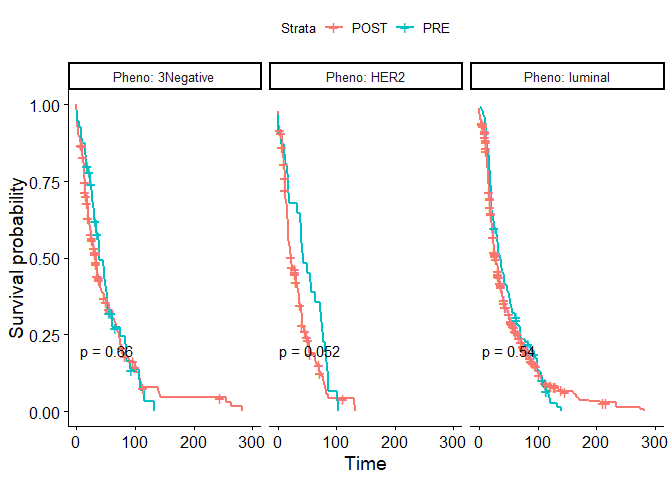<!-- -->

Para este primer caso diferenciamos entre pacientes post y pre menopausicas, y analizamos su supervivencia en base el fenotipo que presenta.

Distinguimos que la supervivencia para pacientes en las que se ha detectado el cancer de forma premenopausica, y tienen el fenotipo HER2, presentan una tasa significativamente mejor de supervivencia; que las pacientes post menopausicas que presentan este mismo fenotipo. 

Para el resto de situaciones no encontramos variaciones significativas entre pacientes post y pre menopausicas en los datos rellenados.


```r
ggsurvplot_facet(fit.meno.trunc, data.reviewed.trunc, facet.by = "Pheno", palette = "Pheno", pval = TRUE)
```

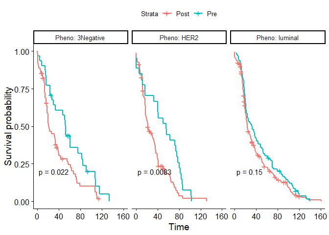<!-- -->


Para los datos truncados podemos ver cómo todos los fenotipos se diferencian significativamente entre las paciente pre y post menopausicas, excepto el fenotipo del **luminal**. 


Esto tiene cierto sentido, porque al no poder diferenciar entre los diferentes subconjuntos de luminal, se crea un grupo mas heterogeneo de pacientes, de entre los cuales no podemos diferenciar su supervivencia según el estado menopausico para este fenotipo.

La diferencia entre datos rellenados y truncados se puede explicar por la forma en la que hemos rellenado los datos. Pese a que en un principio rellenar los datos con la moda y la media pensabamos que no afectaría a los resultados finales. Aquí podemos comprobar que en realidad si que esta afectando a nuestros datos.


```r
ggsurvplot_facet(fit.grado.fill.rev, data.reviewed.fill, facet.by = "nodesCount", palette = "nodesCount", pval = TRUE)
```

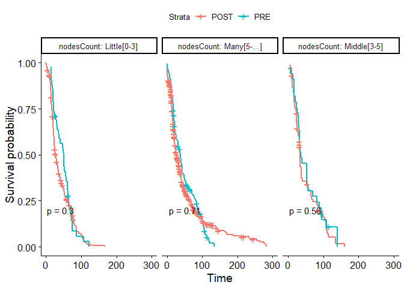<!-- -->

```r
ggsurvplot_facet(fit.grado.trunc.rev, data.reviewed.trunc, facet.by = "nodesCount", palette = "nodesCount", pval = TRUE)
```

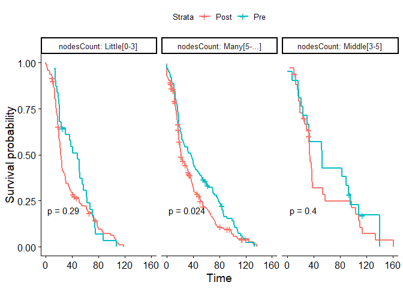<!-- -->


Podemos comprobar al igual que para el caso anterior que la forma en la que hemos rellenado los datos está añadiendo ruido a nuestro resultados. Provocando menor diferenciación entre ellos.

De por sí, no encontramos diferencias significativas entre las pacietnes post y pre menopausicas con menos de cinco nodos para ninguno de los dos conjunto de datos. 

Tan solo, que las pacientes premenopausicas que presentan mas de 5 nodos arrojan una tasa de supervivencia significativamente mayor que las pacientes post menopáusicas que presentan mas de 5 nodos en los datos truncados.


##Análisis de supervivencia de la edad

Vamos a hacer el análisis de supervivencia de la edad, con los rango prederteminados que utilizamos para el dataset anterior. A continuación trataremos de ver la mejor estratificación que podemos hacer para la edad y finalmente compararemos los resultados obtenidos entre ambos datasets.


###Analisis de supervivencia EDAD

En primer lugar necesitamos estratificar los datos.

```r
dat.trun<-data.reviewed.trunc
colnames.trun<-colnames(dat.trun)
colnames.trun[2]<-"stratAge"
colnames(dat.trun)<-colnames.trun
dat.trun$age <- cut(as.numeric(dat.trun$stratAge), breaks = c(0,30,50,100))  #Creando nueva variable

dat.fil<-data.reviewed.fill
colnames.fil<-colnames(dat.fil)
colnames.fil[2]<-"stratAge"
colnames(dat.fil)<-colnames.fil
dat.fil$age <- cut(as.numeric(dat.fil$stratAge), breaks = c(0,30,50,100))  #Creando nueva variable
```


```r
fit.age.fill<-survfit(Surv(time, cens) ~ age, data=dat.fil) 
fit.age.trunc<-survfit(Surv(time, cens) ~ age, data=dat.trun) 

plot_nodos<-list()
plot_nodos[[1]] <- ggsurvplot(fit.age.fill, censor= TRUE, cex.axis=3, cex.lab=3.0, main="Pheno Filled data", pval = TRUE)
plot_nodos[[2]] <- ggsurvplot(fit.age.trunc, censor= TRUE, cex.axis=3, cex.lab=3.0, main="Pheno Filled data", pval = TRUE)
arrange_ggsurvplots(plot_nodos, print = TRUE, ncol =2, nrow = 1)
```

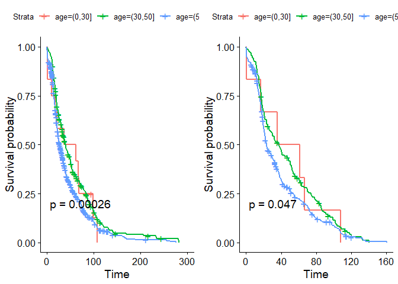<!-- -->

Como podemos apreciar, la diferencia entre las curvas de supervivencia es muy significativa. Pese a que en este caso la distorsión que se genera al rellenar los datos nos favorezca, tomaremos como medida mas "real" los resultados obtenidos con los datos truncados.

Vemos que para las pacientes de una edad avanzada +50 la supervivencia se ve significativamente reducida respecto al resto.

###Optimización de la estratificación

Vamos a probar a realizar el mismo procedidmiento que hemos hecho para el dataset de GBSG2 y vamos a estratificar las edades.


```r
# Con esta función vamos a partir los datos de edad sobre una edad dada y nos devuelve el p-valor para la comparación de la curva 1 a 1.
probar.variable<-function(data, bound, column.name ){
  new.data<-data.frame()
  new.data.1<-data.frame()
  new.data.2<-data.frame()
  new.data.3<-data.frame()
  label.edad<- c()
  edad1<-bound[1]
  edad2<-bound[2]
  for( i in 1:length(data[,1])){
    if(eval(parse(text = (paste(deparse(substitute(data)), column.name, sep="$"))))[i]<=edad1){
      label.edad<-c(label.edad,"Young[0-25]")
    }
    else if(eval(parse(text = (paste(deparse(substitute(data)), column.name, sep="$"))))[i]>edad1 && eval(parse(text = (paste(deparse(substitute(data)), column.name, sep="$"))))[i]<edad2){
      label.edad<-c(label.edad,"Middle[26-50]")
    }
    else if(eval(parse(text = (paste(deparse(substitute(data)), column.name, sep="$"))))[i]>=edad2){
      label.edad<-c(label.edad,"Old[50-...]")
    }
  }
  new.data<-data
  new.data$age<-label.edad
  
  # Ahora tenemos el data frame con los datos correctos. Pasamos a generar 3 data frames.
  new.data.1<-new.data[new.data$age!="Young[0-25]",]
  new.data.2<-new.data[new.data$age!="Middle[26-50]",]
  new.data.3<-new.data[new.data$age!="Old[50-...]",]
  fit1<-survfit(Surv(time,cens) ~ age, data=new.data.1)
  alt1<-surv_pvalue(fit1, data=new.data.1)
  fit2<-survfit(Surv(time,cens) ~ age, data=new.data.2)
  alt2<-surv_pvalue(fit2, data=new.data.2)
  fit3<-survfit(Surv(time,cens) ~ age, data=new.data.3)
  alt3<-surv_pvalue(fit3, data=new.data.3)
  return(c(alt1$pval, alt2$pval, alt3$pval))
}

#probar.variable(data.fill,c(25,50), "age")

# 1st --> Middle & Old
# 2nd --> Young & Old
# 3rd --> Young & Middle

minimiza.pval<-function( init.bound, data, column.name){
  val<-probar.variable(data,init.bound, column.name)
  val1<-probar.variable(data,c(init.bound[1]+1,init.bound[2]), column.name)
  val2<-probar.variable(data,c(init.bound[1],init.bound[2]-1), column.name)
  if(sum(val)>=sum(val1) && sum(val)>=sum(val2) ){
    init.bound[1]<-init.bound[1]+1
    init.bound[2]<-init.bound[2]-1
    minimiza.pval(c(init.bound[1],init.bound[2]), data, column.name)
  }
  else if(sum(val)>=sum(val1) || sum(val)>=sum(val2)){ 
    if(sum(val)>=sum(val1)){
      init.bound[1]<-init.bound[1]+1
      minimiza.pval(c(init.bound[1],init.bound[2]), data, column.name)
    }
    else if(sum(val)>=sum(val2)){
      init.bound[2]<-init.bound[2]-1
      minimiza.pval(c(init.bound[1],init.bound[2]), data, column.name)
    }
  }else if(sum(val)<sum(val1) && sum(val)<sum(val2)){
    final.edad<-c()
    final.val<-c()
    final.edad<-init.bound
    final.val<-val
    return(list(final.edad, final.val))
    break
  }
  
}


aproximacion<-function(data, column, aprox, bound){
  val[[1]][2]<-bound[1]
  val[[1]][1]<-bound[2]
  res.p.val<-c()
  rango.edad<-c()
  while(((as.numeric(val[[1]][2]))-(as.numeric(val[[1]][1])))>5){
    if(aprox=="sup"){
      val<-minimiza.pval(c(as.numeric(val[[1]][1]),as.numeric(val[[1]][2])-1), data, "age")
    }else{
      val<-minimiza.pval(c(as.numeric(val[[1]][1])+1,as.numeric(val[[1]][2])), data, "age")
    }
    res.p.val<-c(res.p.val,sum(val[[2]]))
    rango.edad<-c(rango.edad, paste(val[[1]][1],val[[1]][2], sep="-"))
  }
  return(data.frame(rango.edad=rango.edad, p.val=res.p.val))
}

data.sup.fill<-aproximacion(data.fill, "age", "inf", bound = c(as.numeric(max(data.fill$age)-26), as.numeric(min(data.fill$age))))

data.sup.trunc<-aproximacion(data.trunc, "age", "inf", bound = c(as.numeric(max(data.trunc$age)-24), as.numeric(min(data.trunc$age))))

save(data.sup.trunc, data.sup.fill, file = "savedData/aproxim_TCGA.RData")
```

Haciendo un par de búsquedas rápidas podemos ver fácilmente que hay mucho mejores formas de estratificar las edades. Por ejemplo:


```r
kable(c(sum(probar.variable(data.fill,c(30,50), "age")),
        sum(probar.variable(data.fill,c(45,63), "age")),
        sum(probar.variable(data.trunc,c(30,50), "age")),
        sum(probar.variable(data.trunc,c(44,65), "age"))
        )) %>%
      kable_styling(bootstrap_options = "striped", full_width = F)
```

<table class="table table-striped" style="width: auto !important; margin-left: auto; margin-right: auto;">
 <thead>
  <tr>
   <th style="text-align:right;"> x </th>
  </tr>
 </thead>
<tbody>
  <tr>
   <td style="text-align:right;"> 1.3948813 </td>
  </tr>
  <tr>
   <td style="text-align:right;"> 0.0266317 </td>
  </tr>
  <tr>
   <td style="text-align:right;"> 1.4822619 </td>
  </tr>
  <tr>
   <td style="text-align:right;"> 0.0394708 </td>
  </tr>
</tbody>
</table>

Aquí tenemos el p-value que nos devolvían las estratificaciones propuestas, y hasta cuanto se han podido mejorar. 

Si los comparamos gráficamente podemos notar la diferencia.


```r
dat.trun<-data.reviewed.trunc
colnames.trun<-colnames(dat.trun)
colnames.trun[2]<-"stratAge"
colnames(dat.trun)<-colnames.trun
dat.trun$age <- cut(as.numeric(dat.trun$stratAge), breaks = c(0,45,63,100))  #Creando nueva variable

dat.fil<-data.reviewed.fill
colnames.fil<-colnames(dat.fil)
colnames.fil[2]<-"stratAge"
colnames(dat.fil)<-colnames.fil
dat.fil$age <- cut(as.numeric(dat.fil$stratAge), breaks = c(0,44,65,100))


fit.age.fill<-survfit(Surv(time, cens) ~ age, data=dat.fil) 
fit.age.trunc<-survfit(Surv(time, cens) ~ age, data=dat.trun) 


plot_nodos[[3]] <- ggsurvplot(fit.age.fill, censor= TRUE, cex.axis=3, cex.lab=3.0, main="Pheno Filled data", pval = TRUE)
plot_nodos[[4]] <- ggsurvplot(fit.age.trunc, censor= TRUE, cex.axis=3, cex.lab=3.0, main="Pheno Filled data", pval = TRUE)
arrange_ggsurvplots(plot_nodos, print = TRUE, ncol =2, nrow = 2)
```

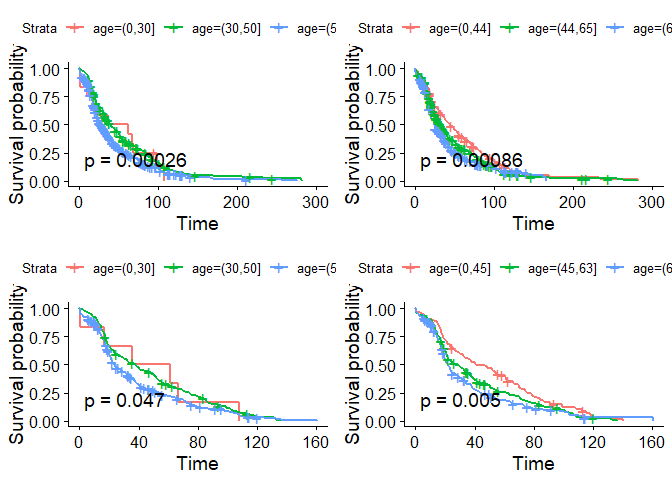<!-- -->


Es muy curiso el rango de edades que tenemos, porque abarca las franjas de edades en las que se agrupa la menopausia (pre, post, y la frontera de edades en las que aparece la menopausia(peri)). Ya hemos comprobado anteriormente que la menopausia es un factor muy significativo y estos resultados parecen estar indicando los mismo. 

##Comparación de la estratificación de edades

Si echamos la vista atrás y recordamos los resultados que hemos obtenido para el set de datos GSBG2:

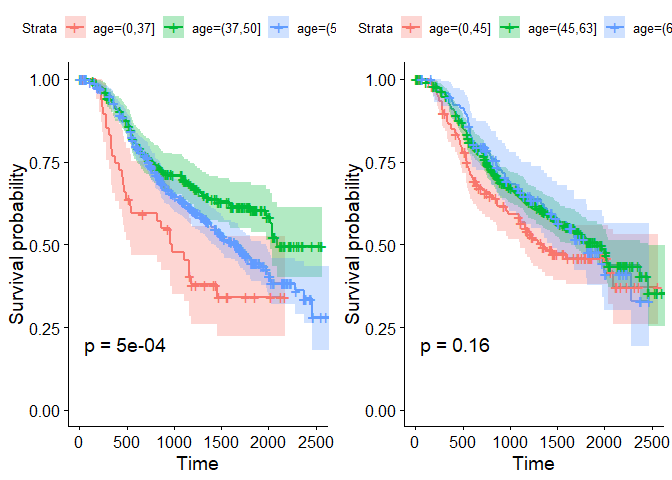<!-- -->

Podemos ver que no coincide con el rango de edades obtenido (gráfica de la izquierda). Lo esperado habría sido obtener algún resultado que estuviese relacionado con la menopausia, pero vemos que si tratamos de establecer esos rangos (gráfica de la derecha) los resultados empeoran sensiblemente. En sentido contrario ocurre lo mismo.

Por lo que podemos decir que la estratificación mas correcta de las edades va a depender de las propias pacientes. 

Probablemente lo que esta ocurriendo es que para el segundo data set, la variable de menopausia esta teniendo mucho peso y hace que las edades se agrupen en torno a ella. Pero en cambio para el primer data set, tengamos también otra variable que tengo peso en el análisis de supervivencia y por ello las edades no se han agrupado en torno a la menopausia sino que se han desviado un poco.


##Modelos de riesgo de Cox

Ya que me he centrado anteriormente en la estratificación de la edad, vamos a comprobar a través de los modelos de riesgo proporcionales de Cox, como afecta estas diferentes estratificaciones de los datos a los resultados.


Se ha implementado un algoritmo de búsqueda exhaustiva que devuelve un dataframe con 3 columnas:

- El Pr(>|z|) que genera el modelo
- Formula
- Número de variables usadas


```r
getExhModelVariabCount <- function(data, indep.var){
  formula<-c()
  pvalue<-c()
  names.data <- names(data)
  x.cols <- length(names(data))-2
  indice.matriz <- combos(x.cols)
  num.var<-c()
  
  for(ind in 1:nrow(indice.matriz$binary)){
    ec.pasag <-paste(colnames(data)[indice.matriz$ragged[ind,]])
    
    ec.indep <- indep.var
    ec.final <- as.formula(paste(ec.indep, paste(ec.pasag, collapse="+"), sep=" ~ "))
    cox.data.norm<-coxph(ec.final, data = data)
    cox.zph<-cox.zph(cox.data.norm)
    if(cox.zph$table[nrow(cox.zph$table),][3]>0.05){
      
      formula<-c(formula, as.character(paste(ec.indep, paste(ec.pasag, collapse="+"), sep=" ~ ")))
      num.var<-c(num.var, length(colnames(data)[indice.matriz$ragged[ind,]]))
      pvalue<-c(pvalue,summary(cox.data.norm)$logtest["pvalue"])
    
    }
    
  }
  dat.resul<-data.frame(formula, pvalue, num.var)
  return(dat.resul)
}


res.fil <- getExhModelVariabCount(dat.fil, "Surv(time,cens)")
res.fil.sin <- getExhModelVariabCount(dat.fil.sin, "Surv(time,cens)")
res.trun <- getExhModelVariabCount(dat.trun, "Surv(time,cens)")
```

```
## Warning in cor(xx, r2): the standard deviation is zero

## Warning in cor(xx, r2): the standard deviation is zero

## Warning in cor(xx, r2): the standard deviation is zero

## Warning in cor(xx, r2): the standard deviation is zero

## Warning in cor(xx, r2): the standard deviation is zero

## Warning in cor(xx, r2): the standard deviation is zero

## Warning in cor(xx, r2): the standard deviation is zero

## Warning in cor(xx, r2): the standard deviation is zero
```

```r
res.trun.sin <- getExhModelVariabCount(dat.trun.sin, "Surv(time,cens)")
```

De esta forma ya tenemos almacenadas todas las posibles combinaciones de variables que cumplen la proporcionalidad de riesgos. De este set de datos es del que vamos a partir para analizar los datos.

###Análisis univariante

Vamos a empezar realizando el análisis univariante para las diferentes variables que tenemos en nuestro set de datos. Todas aquellas variables que cumplen la proporcionalidad de riesgo son :


```r
form.1.fil<- res.fil$formula[res.fil$num.var==1]
form.1.fil
```

```
## [1] Surv(time,cens) ~ Pheno
## Levels: Surv(time,cens) ~ age+Pheno Surv(time,cens) ~ Pheno
```

```r
form.1.fil.sin<- res.fil.sin$formula[res.fil.sin$num.var==1]
form.1.fil.sin
```

```
## [1] Surv(time,cens) ~ age   Surv(time,cens) ~ Pheno
## 3 Levels: Surv(time,cens) ~ age ... Surv(time,cens) ~ Pheno
```

```r
form.1.trun<- res.trun$formula[res.trun$num.var==1]
form.1.trun
```

```
## [1] Surv(time,cens) ~ age      Surv(time,cens) ~ menostat
## [3] Surv(time,cens) ~ Pheno   
## 13 Levels: Surv(time,cens) ~ age ... Surv(time,cens) ~ Pheno
```

```r
form.1.trun.sin<- res.trun.sin$formula[res.trun.sin$num.var==1]
form.1.trun.sin
```

```
## [1] Surv(time,cens) ~ age      Surv(time,cens) ~ menostat
## [3] Surv(time,cens) ~ Pheno   
## 12 Levels: Surv(time,cens) ~ age ... Surv(time,cens) ~ Pheno
```
Hemos filtrado por aquellas formulas que solo tienen una variable y que cumplen la regla de proporcionalidad [p>0.05]. De entre todas las combinaciones:

- Aparece en todas **Pheno**
- Aparece en 3/4 variantes **Age**
- Aparece en 2/4 variantes **menostat**

La variable **age** aparece más en los datos que no han sido re-estratificados, probablemente por lo mismo que ocurría para el dataset anterior. La variable menopausia aparece para los datos truncados solo.

Puesto que **Pheno** está igual estratificada en solo vamos a ver las diferencias que presenta en los datos rellenados frente a los datos truncados.


```r
cox.pheno.fil<-coxph(Surv(time, cens) ~ Pheno , data = dat.fil)
cox.pheno.fil
```

```
## Call:
## coxph(formula = Surv(time, cens) ~ Pheno, data = dat.fil)
## 
##                 coef exp(coef) se(coef)     z       p
## PhenoHER2    0.30877   1.36175  0.11189 2.760 0.00579
## Phenoluminal 0.04761   1.04876  0.08331 0.571 0.56769
## 
## Likelihood ratio test=8.59  on 2 df, p=0.01363
## n= 1101, number of events= 947
```

```r
cox.pheno.trun<-coxph(Surv(time, cens) ~ Pheno , data = dat.trun)
cox.pheno.trun
```

```
## Call:
## coxph(formula = Surv(time, cens) ~ Pheno, data = dat.trun)
## 
##                coef exp(coef) se(coef)     z     p
## PhenoHER2    0.2100    1.2337   0.1500 1.400 0.162
## Phenoluminal 0.0435    1.0445   0.1248 0.349 0.727
## 
## Likelihood ratio test=2.44  on 2 df, p=0.295
## n= 534, number of events= 484
```

En los datos truncados se obtienen unos resultados sensiblemente peores. Como indican tanto las betas asociados a los niveles como el likelihood ratio. O lo que es lo mismo, la variable **Pheno** explica mejor el modelo para los datos rellenados que para los datos truncados.

*¿Qué pasa con la edad?*


```r
cox.age.re<-coxph(Surv(time, cens) ~ age , data = dat.trun)
cox.age.re
```

```
## Call:
## coxph(formula = Surv(time, cens) ~ age, data = dat.trun)
## 
##               coef exp(coef) se(coef)     z       p
## age(45,63]  0.2949    1.3430   0.1242 2.374 0.01761
## age(63,100] 0.4417    1.5554   0.1368 3.230 0.00124
## 
## Likelihood ratio test=10.96  on 2 df, p=0.004167
## n= 534, number of events= 484
```

```r
cox.age.sin<-coxph(Surv(time, cens) ~ age , data = dat.trun.sin)
cox.age.sin
```

```
## Call:
## coxph(formula = Surv(time, cens) ~ age, data = dat.trun.sin)
## 
##                coef exp(coef) se(coef)      z     p
## age(30,50]  -0.0203    0.9799   0.4168 -0.049 0.961
## age(50,100]  0.2223    1.2489   0.4124  0.539 0.590
## 
## Likelihood ratio test=6.25  on 2 df, p=0.04399
## n= 534, number of events= 484
```


Claramente podemos ver que nos ocurre igual que para el otro dataset. A si que no voy a entrar en mucho detalle. Tan solo destacar que a diferencia de lo ocurrido para el dataset anterior, en este caso la re-estratificación de los niveles está ayudando a mejorar los resultados.

Ya solo queda por mirar la variable **menostat**.


```r
cox.meno.sin<-coxph(Surv(time, cens) ~ menostat , data = dat.trun.sin)
cox.meno.sin
```

```
## Call:
## coxph(formula = Surv(time, cens) ~ menostat, data = dat.trun.sin)
## 
##                coef exp(coef) se(coef)      z       p
## menostatPre -0.3049    0.7372   0.1006 -3.031 0.00244
## 
## Likelihood ratio test=9.54  on 1 df, p=0.00201
## n= 534, number of events= 484
```

Como ya sabemos y hemos mirado anteriormente para la variable **age**. Los resultados que aporta **menostat** serán iguales tanto para los datos estratificados como para los sin re-estratificar. Esto es debido a que la estratificación de la edad no afecta a la varaible menostat.

Como podemos ver, en los datos truncados, **menostat** aporta mucha información. Para menostat = Pre, tenemos un incremento del riesgo rescpecto a horTh = Post de 0.7. O lo que es lo mismo, para las paciente post-menopausicas observamos una disminución de la esperanza de supervivencia.


###Análisis multivariante

Ya habíamos calculado anteriomente todos los modelos que cumplían las reglas de proporcionalidad.

Pasamos a ver para cada número de variables que fórmula arroja los mejores resultados.

Esto podemos hacerlo de una forma rápida así:


```r
res.fil.ord<-sapply(1:max(res.fil$num.var), function(x)
    list(toString(res.fil[res.fil$num.var==x,][which.min(res.fil[res.fil$num.var==x,]$pvalue),]$formula ),
      res.fil[res.fil$num.var==x,][which.min(res.fil[res.fil$num.var==x,]$pvalue),]$pvalue ,x)  )


res.fil.sin.ord<-sapply(1:max(res.fil.sin$num.var), function(x)
    list(toString(res.fil.sin[res.fil.sin$num.var==x,][which.min(res.fil.sin[res.fil.sin$num.var==x,]$pvalue),]$formula ),
      res.fil.sin[res.fil.sin$num.var==x,][which.min(res.fil.sin[res.fil.sin$num.var==x,]$pvalue),]$pvalue , x) )

res.trun.ord<-sapply(1:max(res.trun$num.var), function(x)
    list(toString(res.trun[res.trun$num.var==x,][which.min(res.trun[res.trun$num.var==x,]$pvalue),]$formula ),
      res.trun[res.trun$num.var==x,][which.min(res.trun[res.trun$num.var==x,]$pvalue),]$pvalue , x) )

res.trun.sin.ord<-sapply(1:max(res.trun.sin$num.var), function(x)
    list(toString(res.trun.sin[res.trun.sin$num.var==x,][which.min(res.trun.sin[res.trun.sin$num.var==x,]$pvalue),]$formula ),
      res.trun.sin[res.trun.sin$num.var==x,][which.min(res.trun.sin[res.trun.sin$num.var==x,]$pvalue),]$pvalue , x) )

res.fil.ord<-t(res.fil.ord)
res.fil.sin.ord<-t(res.fil.sin.ord)
res.trun.ord<-t(res.trun.ord)
res.trun.sin.ord<-t(res.trun.sin.ord)
```

```r
kable(res.fil.ord)%>%
      kable_styling(bootstrap_options = "striped", full_width = F)
```

<table class="table table-striped" style="width: auto !important; margin-left: auto; margin-right: auto;">
<tbody>
  <tr>
   <td style="text-align:left;"> Surv(time,cens) ~ Pheno </td>
   <td style="text-align:left;"> 0.0136278331637202 </td>
   <td style="text-align:left;"> 1 </td>
  </tr>
  <tr>
   <td style="text-align:left;"> Surv(time,cens) ~ age+Pheno </td>
   <td style="text-align:left;"> 0.000122548473032735 </td>
   <td style="text-align:left;"> 2 </td>
  </tr>
</tbody>
</table>

```r
kable(res.fil.sin.ord)%>%
      kable_styling(bootstrap_options = "striped", full_width = F)
```

<table class="table table-striped" style="width: auto !important; margin-left: auto; margin-right: auto;">
<tbody>
  <tr>
   <td style="text-align:left;"> Surv(time,cens) ~ age </td>
   <td style="text-align:left;"> 0.00020142660247184 </td>
   <td style="text-align:left;"> 1 </td>
  </tr>
  <tr>
   <td style="text-align:left;"> Surv(time,cens) ~ age+Pheno </td>
   <td style="text-align:left;"> 2.73021285523872e-05 </td>
   <td style="text-align:left;"> 2 </td>
  </tr>
</tbody>
</table>

Podemos ver cómo para los datos rellenados solo llegamos a tener como mejor resultado una fórmula con dos variables. Además podemos ver que la aproximación final del likelihood ratio es muy similar. Por lo que podríamos decir que con la estratificación nueva de pacientes hemos conseguido reajustar los rangos de las edades sin que llegue a afectar al modelo. Es normal que para los datos que hemos re-estratificado de un poco peor. Esto es debido a que tenemos mucho mayor número de pacientes por intervalo.


```r
kable(res.trun.ord)%>%
      kable_styling(bootstrap_options = "striped", full_width = F)
```

<table class="table table-striped" style="width: auto !important; margin-left: auto; margin-right: auto;">
<tbody>
  <tr>
   <td style="text-align:left;"> Surv(time,cens) ~ menostat </td>
   <td style="text-align:left;"> 0.00200985036376046 </td>
   <td style="text-align:left;"> 1 </td>
  </tr>
  <tr>
   <td style="text-align:left;"> Surv(time,cens) ~ menostat+nodesCount </td>
   <td style="text-align:left;"> 7.07800844944263e-05 </td>
   <td style="text-align:left;"> 2 </td>
  </tr>
  <tr>
   <td style="text-align:left;"> Surv(time,cens) ~ age+menostat+nodesCount </td>
   <td style="text-align:left;"> 0.000140500436973809 </td>
   <td style="text-align:left;"> 3 </td>
  </tr>
  <tr>
   <td style="text-align:left;"> Surv(time,cens) ~ age+menostat+nodesCount+Pheno </td>
   <td style="text-align:left;"> 0.000434890988772629 </td>
   <td style="text-align:left;"> 4 </td>
  </tr>
</tbody>
</table>

```r
kable(res.trun.sin.ord)%>%
      kable_styling(bootstrap_options = "striped", full_width = F)
```

<table class="table table-striped" style="width: auto !important; margin-left: auto; margin-right: auto;">
<tbody>
  <tr>
   <td style="text-align:left;"> Surv(time,cens) ~ menostat </td>
   <td style="text-align:left;"> 0.00200985036376046 </td>
   <td style="text-align:left;"> 1 </td>
  </tr>
  <tr>
   <td style="text-align:left;"> Surv(time,cens) ~ nodesCount+Pheno </td>
   <td style="text-align:left;"> 0.00383544843738835 </td>
   <td style="text-align:left;"> 2 </td>
  </tr>
  <tr>
   <td style="text-align:left;"> Surv(time,cens) ~ menostat+nodesCount+Pheno </td>
   <td style="text-align:left;"> 0.000305169196151805 </td>
   <td style="text-align:left;"> 3 </td>
  </tr>
  <tr>
   <td style="text-align:left;"> Surv(time,cens) ~ age+menostat+nodesCount+Pheno </td>
   <td style="text-align:left;"> 0.00149693253163986 </td>
   <td style="text-align:left;"> 4 </td>
  </tr>
</tbody>
</table>

Lo primero que nos llama la atención es que para los datos truncados si que tenemos bastantes mas combinaciones que cumplen la regla de proporcionalidad de los datos. También podemos ver que la estratificación de las variables ha afectado muy positivamente a nuestro modelo, mejorándolo. Casi en dos órdenes de magnitud como media.

Entonces si ya hemos visto que los rangos de edades dependen de la población. ¿Cómo se toma la decisión de estandarizar un rango de 30-50?

## Comprobar rango estandar


Bueno, según tengo entendido, el rango 30-50 debería tener los valores mejores mas parecidos entre ambos sets de datos. Entonces, vamos a comprobarlo un poco a fuerza bruta para comprobar si es cierto. Aunque podría ser que, por la poca cantidad de variables que tenemos que coinciden, que el resultado que obtengamos no sea el esperado.


```r
matr<-sapply(28:68, function(i) sapply(30:70, function(j)
  
  (probar.variable(GBSG2,c(i,j), "age")[3]- probar.variable(data.reviewed.trunc,c(i,j), "age")[3] )
  
  ))

resul<-as.matrix(t(matr))
```

```r
load(file="savedData/final_matrx.RData")
```

```r
load(file="savedData/final_matrx.RData")
```


Tenemos que "x" será en valor inferior y "y" será el valor superior del rango de edades. Teniendo esto resulta fácil buscar cual es el valor mínimo (Valores absolutos). 


```r
which(abs(resul) == min(abs(resul), na.rm = T), arr.ind = TRUE)
```

```
##      row col
## [1,]  16  41
```

```r
resul[which(abs(resul) == min(abs(resul), na.rm = T), arr.ind = TRUE)]
```

```
## [1] -0.000107988
```

Curiosmanete, podemos ver que el resultado obtenido esta bastante alejado del que esperábamos. Vemos que para las edades [44,71] (16+28=44 y 41+30=71) tenemos la menor diferencia entre los resultados obtenidos. Pese a que no se esperaba obtener el rango estandar de 30-50, parecia razonable obtener algo que se acercase. 

Pero, si tenemos que decir una edad para poder estratificar las edades arrojando la menor diferencia entre los resultados, la que tendriamos que dar es [44,71]. Teóricamente, si la estratificacion estandar ha sido tomada correctamente, conforme vamos añadiendo datasets, iriamos obteniendo resultados mas cercanos a la estratificación estandar que está estipulada.


