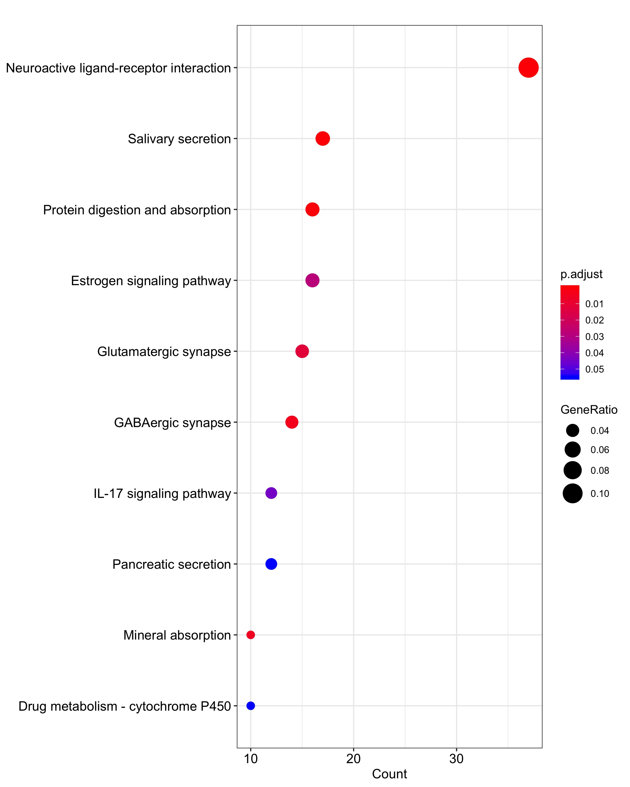
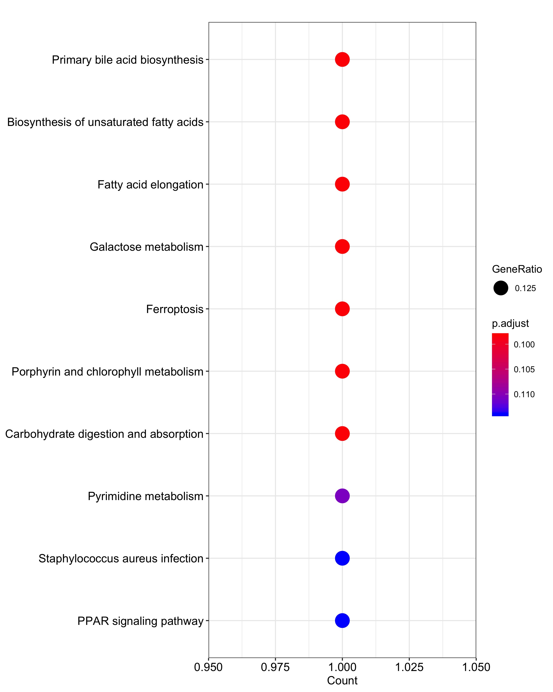
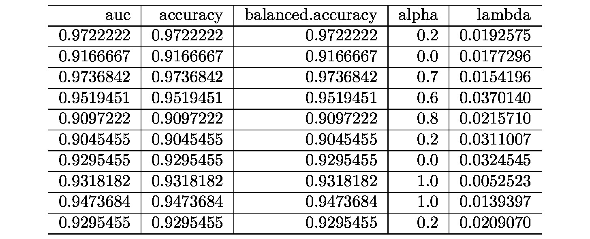
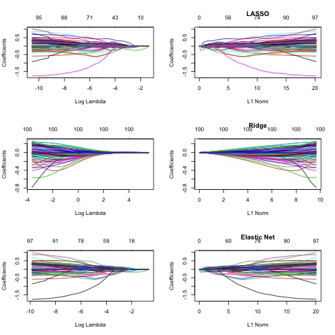
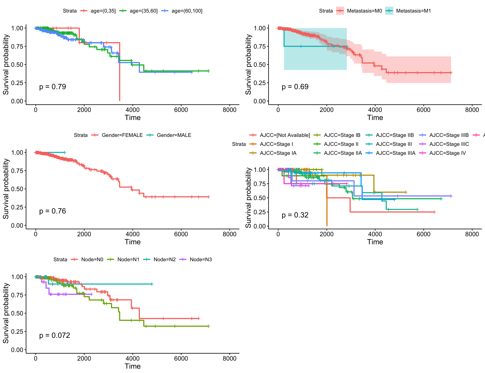
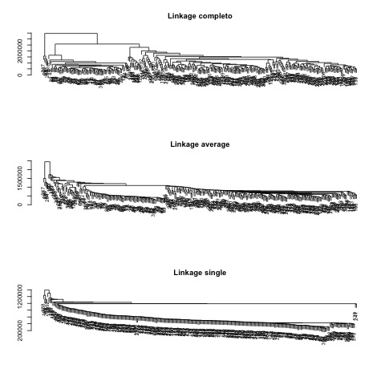
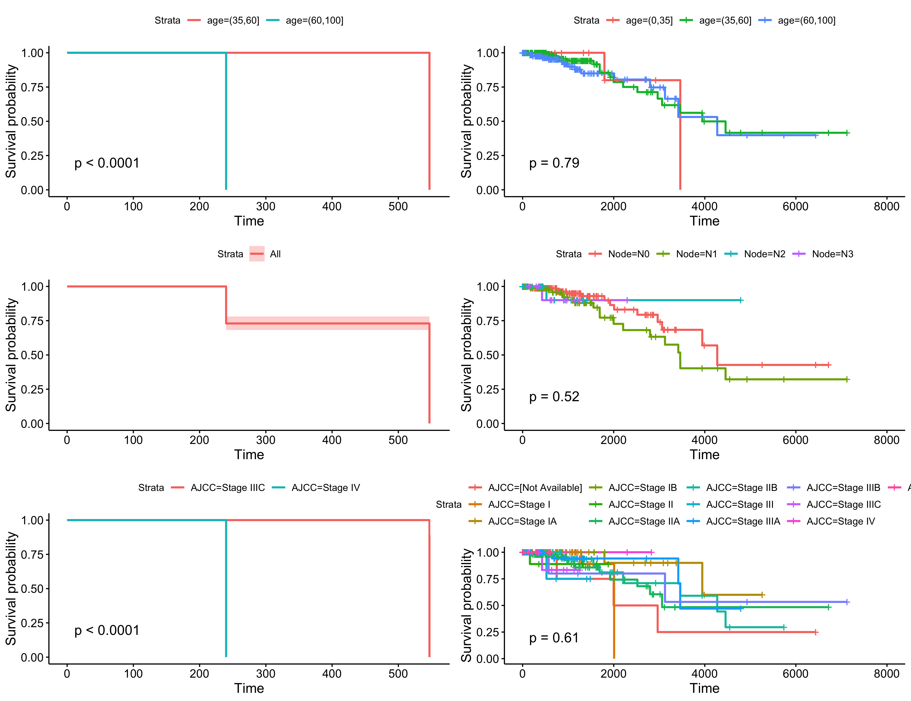

```{r setup, include=FALSE}
knitr::opts_chunk$set(echo = TRUE)
```


#Introducción

Para esta práctica he implementado un workflow en el que encontramos diferentes modulos:

- Descargamos los datos de TCGA para breast cancer.
    + Seleccionamos aquellos genes que se encuentra sobrerepresentados para Luminal y para TNBC (Triple negativo).
    + Unimos los datos clinicos con los datos de expresión
    
- Volcano plot

- Análisis de enriquecimiento
    + Enriquecimiento de los genes
    + Obtención de las variables mas significativas

- Replicamos los datos
    + Replicamos los datos.
    + Balanceamos los datos.

- Calculamos el AUC para lasso/ridge
    + Calculamos utilizando como métrica AUC el mejor alpha y lambda. (Lasso/ridge/elasticnet)
    + Sacamos la matriz de confusión para el AUC del mejor alpha.
    
- Calculamos el AUC para GLM, NNET y DT
    + Calculamos el 10-CV AUC
    + Añadimos cierta información de los resultados
    
- Analisis de supervivencia y Clustering
    + Guardamos las curvas de supervivencia de algunas variables interesantes para los datos globales.
    + Clusterizamos los pacientes
    + Recalculamos las curvas de supervivencia para los clusters
    
  
  
En este trabajo explicaré los diferentes resultados así como las decisiones que se han obtenido a lo largo del proyecto. La idea es generar un workflow que nos devuelva información útil para tratar datos de BRCA obtenidos de TCGA. Concretamente, busco que el flujo de trabajo determine si merece la pera utilizar Lasso/ridge o algún otro método de machine learning. Además vamos a buscar conexiones funcionales que podrían dar sentido biológico a los genes que hay en cada modelo predictivo a través de un enriquecimiento funcional de dichos genes. Y finalmente comprobar si podemos agrupar los diferentes pacientes en diferentes clusters y analizar la diferencia de supervivencia de los diferentes subgrupos.

#Workflow

El workflow ha sido implementado en bash. Podemos seleccionar diferentes parámetros a la hora de ejecutarlo. Contiene una función usage en caso de que se ecriban mal los parámetros para orientarnos sobre como deberíamos escribirlos.

```
usage: ./work.sh [-svb] [-l number] [-p number] [-t number]
  -s      skip downloading the data if downloaded
  -v      create volcano plot
  -b 		Balancea los datos para las predicciones
  -l number  Set LogFC, for downloading the data, for the volcano or both.
  -f string  Set the feature selection method. (NONE, COX or RFI)
  -p number  Set P-value, for downloading the data, for the volcano or both.
  -t number  Set the step for the data replication.
```
Los resultados que me han parecido interesantes guardar se encuentrar organizados dentro de la carpeta `results` mientras que los datos intermedios y datos brutos se encuentran en la carpeta de datos.


##Descargar datos y determinar expresión diferencial

###Datos clínicos 

Para seleccionar las variables de los datos clínicos, he comprobado que no tengan muchos valores perdidos y he buscado aquellas variables que resulten mas informativas. He decidido truncar los pacientes con valores perdidos; como posteriormente los datos se van a replicar podemos permitirnos truncar los pacientes que tengar valores perdidos.

Concretamente se han seleccionado las siguientes variables:

- CompleteTCGAID
- Gender
- **AgeatInitialPathologicDiagnosis**
- ERstatus
- PRstatus
- HERFinalstatus
- Tumor
- **Node**
- Node-Coded
- **Metastasis**
- **AJCCStage**
- VitalStatus
- **status**
- **time**
- **PAM50mRNA**


Estos datos clínicos, como podemos apreciar, han sido obtenidos de una tabla donde encotramos muestras de cancer de mama clasificadas por subtipos de PAM50, y por ER status, PR status y HER2 Final status.

###Datos de expresión

Los datos de expresión han sido obtenidos de TCGA como vimos en clase:
```{r eval=FALSE}
brcaData <- getFirehoseData(dataset="BRCA", runDate="20160128",gistic2Date="20160128",forceDownload=F, clinical =TRUE, RNASeq2GeneNorm  =TRUE)
brca_rnaseq <- getData(brcaData,type = "RNASeq2GeneNorm")
brca_rnaseq.tumour <- brca_rnaseq[, which(as.numeric(substr(colnames(brca_rnaseq), 14,15)) < 10)]
colnames(brca_rnaseq.tumour) <- substr(colnames(brca_rnaseq.tumour), 1,12)
brca_rnaseq.tumour <- brca_rnaseq.tumour[, !duplicated(colnames(brca_rnaseq.tumour))]

```
 Una vez descargados hemos seleccionados aquellos genes que aparecen tanto en Luminal como en TNBC. El subtipo de Luminal tiene baja proliferación y tiene menos recaida, mientras que el subtipo de TNBC es mucho mas agresivo. Los resultados de expresión diferencial para cada subtipo se van a unir generando una matriz de diseño.
 
 A continuación haremos el análisis de expresión diferencial. Convertimos nuestra matriz de counts para poder aplicar el método de Voom que estima la variación media de los log-counts (de counts) generando pesos para cada observación. Así ya tendremos los datos preparados para poder aplicar a estos datos de expresión los métodos ideados para el análisis de microarrays.
 
```{r eval=FALSE}
tnbc_samples <- sample_data %>% dplyr::filter(`ER Status` == "Negative" & `PR Status` == "Negative" & `HER2 Final Status` == "Negative" & `PAM50 mRNA` != "Luminal A")
tnbc_barcodes <- tnbc_samples$`Complete TCGA ID`
brca_rnaseq.tnbc <- brca_rnaseq.tumour[, which(colnames(brca_rnaseq.tumour) %in% tnbc_barcodes)]

luminal_samples <- sample_data %>% dplyr::filter(`PAM50 mRNA` == "Luminal A")
luminal_barcodes <- luminal_samples$`Complete TCGA ID`
brca_rnaseq.luminal <- brca_rnaseq.tumour[, which(colnames(brca_rnaseq.tumour) %in% luminal_barcodes)]

rnaseq.for.de <- cbind(brca_rnaseq.luminal, brca_rnaseq.tnbc)
counts = rnaseq.for.de[apply(rnaseq.for.de,1,function(x) sum(x==0))<ncol(rnaseq.for.de)*0.8,]

df.l <- data_frame("sample" = colnames(brca_rnaseq.luminal), "status" = rep(0, length(colnames(brca_rnaseq.luminal))) )
df.t <- data_frame("sample" = colnames(brca_rnaseq.tnbc), "status" = rep(1, length(colnames(brca_rnaseq.tnbc))) )
df <- rbind(df.l,df.t)
design <- model.matrix(~ status, data = df)

dge <- DGEList(counts=counts)
A <- rowSums(dge$counts)
isexpr <- A > 100 # Keeping genes with total counts more than 100.
dge <- calcNormFactors(dge)
v <- voom(dge[isexpr,], design, plot=FALSE)

fit <- lmFit(v, design)
fit <- eBayes(fit)

diff.exp.df <- topTable(fit, coef = "status", n = Inf, sort = "p", p = 0.01) # Positive log-fold-changes mean higher expression in d1
diff.exp.df$gene.name <- rownames(diff.exp.df)
```
 
Ahora ya podemos sacar los valores de la expresión diferencial de los genes. Una vez tenemos todos los datos, mostraremos los siguientes sets de datos. 

- Variables clínicas con todos los pacientes.
- Variables clínicas quitando los datos vacíos.
- Variables clínicas (exclusivamente) de los pacientes que tienen el análisis de expresión.
- Variables clínicas y de expresión. Para los pacientes que tengan ambas.

De esta forma podemos tener un seguimiento rápido sobre el filtrado general que hemos hecho a los datos.

```{r eval=FALSE}
menor <- diff.exp.df[diff.exp.df$logFC<(-lfc),]
mayor <- diff.exp.df[diff.exp.df$logFC>lfc,]
sobreexp <- rbind(menor,mayor)
sobreexp <- sobreexp[ sobreexp$adj.P.Val<pval,]

genes.model <- counts[sobreexp$gene.name,]
genes.model <- t(genes.model)
genes.model<- data.frame(genes.model)

genes.model$`Complete TCGA ID` <- rownames(genes.model)
compact<- sample_data[c(sample_data$`Complete TCGA ID`) %in% genes.model$`Complete TCGA ID`,]
join <- inner_join(compact, genes.model)

clinicos.sin.quitar.vacios<- sample_data_1
clinicos.completos.sin.exp <- sample_data
clinicos.reducidos <- compact
clinicos.expresion <- join
```
```{r echo=FALSE}
load(file="datos/survival_plus_expression.RData")
```
```{r}
cat("Los datos originales tienen unas dimensiones de: ", dim(clinicos.sin.quitar.vacios)[1],"x",dim(clinicos.sin.quitar.vacios)[2],
    "\nLos datos filtrados tienen unas dimensiones de: ", dim(clinicos.completos.sin.exp)[1],"x",dim(clinicos.completos.sin.exp)[2],
    "\nLos datos reducidos tienen unas dimensiones de: ", dim(clinicos.reducidos)[1],"x",dim(clinicos.reducidos)[2],
    "\nLos datos finales tienen unas dimensiones de: ", dim(clinicos.expresion)[1],"x",dim(clinicos.expresion)[2], "\n"
    )

```


##Volcano plot

Los datos que utiliza son los de expresión de los genes `diff.exp.df`. Para hacer el volcano plot sencillamente cogeremos los genes que aparecen expresados diferencialmente y los plotearemos como se ve en el codigo.

```{r echo=FALSE,message=FALSE, warning=FALSE}

load( file="datos/expressionData.RData")
pval<-0.01
lfc<-4
library("dplyr")
library("calibrate")
```

```{r}

cat("El lfc para los datos descargados es ", lfc," y el p-valor es de ", pval, "\n")
tab = data.frame(logFC = diff.exp.df$logFC, negLogPval= -log10(diff.exp.df$adj.P.Val))
tab2 = data.frame(logFC = diff.exp.df$logFC, negLogPval= -log10(diff.exp.df$adj.P.Val), Gene=diff.exp.df$gene.name)
  
par(mar = c(5, 4, 4, 5))
plot(tab, pch = 16, cex = 0.6, xlab = expression(log[2]~fold~change), ylab = expression(-log[10]~pvalue))
#signGenes = (abs(tab$logFC) > lfc & tab$negLogPval > -log10(pval))
points(tab[(abs(tab$logFC) > lfc), ], pch = 16, cex = 0.8, col = "orange") 
points(tab[(tab$negLogPval > -log10(pval)), ], pch = 16, cex = 0.8, col = "green") 
points(tab[(abs(tab$logFC) > lfc & tab$negLogPval > -log10(pval)), ], pch = 16, cex = 0.8, col = "red") 
abline(h = -log10(pval), col = "green3", lty = 2) 
abline(v = c(-lfc, lfc), col = "blue", lty = 2) 
mtext(paste("pval =", pval), side = 4, at = -log10(pval), cex = 0.8, line = 0.5, las = 1) 
mtext(c(paste("-", lfc, "fold"), paste("+", lfc, "fold")), side = 3, at = c(-lfc, lfc), cex = 0.8, line = 0.5)
with(subset(tab2, negLogPval > -log10(pval) & abs(logFC)>lfc), textxy(logFC, negLogPval, labs=Gene, cex=.4))
```

Como vemos este gráfico resulta muy ilustrativo para poder apreciar cuantitativamente la expresión diferencial de los genes.

##Analisis de enriquecimiento y selección de variables

El siguiente modulo que nos encontramos en el workflow es el de selección de variables y enriquecimiento de genes. Lo se ha hecho en este módulo es consultar en la ontología de funciones por el conjunto de genes que tenemos. El codigo que tenemos a continuación se usará dos veces, la primera vez nos devolverá el enriquecimiento de los genes que tenemos expresados diferencialmente. 

```{r eval=FALSE}
enrich_cp = function(res, comparison, type="over") {
    res = res %>% data.frame()  %>% left_join(entrezsymbol, by = "hgnc_symbol") %>% filter(!is.na(entrezgene))
    # universe = brcaData@GISTIC@AllByGene$Gene.Symbol
    if(type=="all"){
      res <- res %>% filter(abs(logFC) > lfc & adj.P.Val < pval) # lfc and pval threshold defined above in the volcano plot
      genes = res$entrezgene
      
      mf = enrichGO(genes, OrgDb = orgdb, ont = "MF", pAdjustMethod = "BH",
                    qvalueCutoff = 1, pvalueCutoff = 1)
      cc = enrichGO(genes,  OrgDb = orgdb, ont = "CC", pAdjustMethod = "BH",
                    qvalueCutoff = 1, pvalueCutoff = 1)
      bp = enrichGO(genes,  OrgDb = orgdb, ont = "BP", pAdjustMethod = "BH",
                    qvalueCutoff = 1, pvalueCutoff = 1)
      kg = enrichKEGG(gene = genes, organism = keggname, pvalueCutoff = 1,
                      qvalueCutoff = 1, pAdjustMethod = "BH")
      all = list(mf = mf, cc = cc, bp = bp, kg = kg)
      all[["summary"]] = summarize_cp(all, comparison)
      return(all)
    }
    if(type=="over"){
      res.over <- res %>% filter(logFC > lfc  & adj.P.Val < pval)
      genes = res.over$entrezgene
      mf = enrichGO(genes, OrgDb = orgdb, ont = "MF", pAdjustMethod = "BH",
                    qvalueCutoff = 1, pvalueCutoff = 1)
      cc = enrichGO(genes,  OrgDb = orgdb, ont = "CC", pAdjustMethod = "BH",
                    qvalueCutoff = 1, pvalueCutoff = 1)
      bp = enrichGO(genes,  OrgDb = orgdb, ont = "BP", pAdjustMethod = "BH",
                    qvalueCutoff = 1, pvalueCutoff = 1)
      kg = enrichKEGG(gene = genes, organism = keggname, pvalueCutoff = 1,
                      qvalueCutoff = 1, pAdjustMethod = "BH")
      all = list(mf = mf, cc = cc, bp = bp, kg = kg)
      all[["summary"]] = summarize_cp(all, comparison)
      return(all)
    }
    
    if(type=="under"){
      res.under <- res %>% filter(logFC < -lfc & adj.P.Val < pval)
      genes = res.under$entrezgene
      mf = enrichGO(genes, OrgDb = orgdb, ont = "MF", pAdjustMethod = "BH",
                    qvalueCutoff = 1, pvalueCutoff = 1)
      cc = enrichGO(genes,  OrgDb = orgdb, ont = "CC", pAdjustMethod = "BH",
                    qvalueCutoff = 1, pvalueCutoff = 1)
      bp = enrichGO(genes,  OrgDb = orgdb, ont = "BP", pAdjustMethod = "BH",
                    qvalueCutoff = 1, pvalueCutoff = 1)
      kg = enrichKEGG(gene = genes, organism = keggname, pvalueCutoff = 1,
                      qvalueCutoff = 1, pAdjustMethod = "BH")
      all = list(mf = mf, cc = cc, bp = bp, kg = kg)
      all[["summary"]] = summarize_cp(all, comparison)
      return(all)
    }
  }
  
  convert_enriched_ids = function(res, entrezsymbol) {
    res = res %>% mutate(geneID = strsplit(as.character(geneID), "/")) %>% tidyr::unnest(geneID) %>% 
      left_join(entrezsymbol, by = c(geneID = "entrezgene")) %>% group_by(ID, 
                                                                          Description, GeneRatio, BgRatio, pvalue, p.adjust, qvalue, Count, ont, 
                                                                          comparison) %>% summarise(geneID = paste(geneID, collapse = "/"), symbol = paste(hgnc_symbol, 
                                                                                                                                                           collapse = "/"))
    return(res)
  }
  
  
  orgdb = "org.Hs.eg.db"
  biomart_dataset = "hsapiens_gene_ensembl"
  keggname = "hsa"
  mart = biomaRt::useMart(biomart = "ensembl", dataset = biomart_dataset)
  entrezsymbol = biomaRt::getBM(attributes = c("entrezgene", "hgnc_symbol"), mart = mart)
  entrezsymbol$entrezgene = as.character(entrezsymbol$entrezgene)
  res = diff.exp.df
  names(res) <- c("logFC", "AveExpr", "t", "P.Value", "adj.P.Val", "B", "hgnc_symbol")
  enrich_rs = enrich_cp(res, "TNBC/LumA", type="all")
  enrich_summary = enrich_rs$summary %>% arrange(p.adjust)
  enrich_summary = convert_enriched_ids(enrich_summary,entrezsymbol = entrezsymbol) %>% arrange(p.adjust)
  write.csv(enrich_summary, "datos/tnbc_luma_enrichment.csv")
  
  
```

```{r, echo=FALSE, out.width = "450px"}

```

Podemos ver que para los genes que se expresan diferencialmente, participan principalmente en el pathway de `Neuroactive ligand-receptor interaction`. Lo que es muy interesante, si buscamos en la literatura, podemos encontrar mucha información sobre este pathway.

El pathway `neuroactive ligand-receptor interaction` desempeña funciones en enfermedades neuronales, como por ejemplo en el caso del Parkinson. Aunque también se ha visto que desempeña funciones en el desarrollo de desórdenes adictivos, como es el caso de la dependencia al alcohol. Se han identificado cursos de tiempos en los que algunos genes pueden ser estimulados o inhibidos por estradiol en el cancer de mama humano, los resultados indican que estos cambios se enriquecen a las 24 horas de que un gen interacciones con este pathway. Un estudio de la subred en el cancer de mama reveló que los pathways `oocyte meiosis` eran subredes muy importantes de este pathway. @ncbi

Una vez hecho el enriquecimiento funcional de los genes, se realizó una selección de variables con el objetivo de quedarnos con los genes que resulten mas significativos. Para ello se ha dado la opción en el flujo de trabajo de:

- Usar COX, para sacar los betas asociados a cada variable y coger las de mayor importancia.

```{r eval=FALSE}
# Sacamos mejores variables exhaustive
  ranking.var<-function(df,indep.var){
    indep.var<-"Surv(time,status)"
    names.col<- colnames(df)[!colnames(df) %in% c("Node-Coded", "time", "status", "VitalStatus")]
    pvalue<-c()
    formula<-c()
    for (i in names.col) {
      ec.final<-as.formula(c("Surv(time,status) ~", i))
      cox.data.norm<-coxph(ec.final, data = df)
      cox.zph<-cox.zph(cox.data.norm)
      #Comprobamos que la variable cumplen la proporcionalidad de riesgos
      if(cox.zph$table[nrow(cox.zph$table),][3]>0.05){
        
        formula<-c(formula,  i)
        pvalue<-c(pvalue,summary(cox.data.norm)$logtest["pvalue"])
        
      }
    }
    
    variables<-ranking.var(clinicos.expresion, "Surv(time,status)")
```

- Usar random forest para seleccionar las variables de mayor importancia, que da muy malos resultados.

```{r eval=FALSE}
formula<-as.simple.formula(paste(colnames(clinicos.expresion[!colnames(clinicos.expresion) %in% c("Node-Coded", "CompleteTCGAID","VitalStatus")]),collapse = "+"),"status")
weights <- random.forest.importance(formula, clinicos.expresion)
variables<-cutoff.k(weigths,50)
```

- No aplicar ningun método de filtrado

Me parecía muy interesante incluir aquí la selección de las variables de los modelos predictivos para poder hacer el análisis de enriquecimiento solo con los genes seleccionados. Si nos fijamos en los resultados del test de enriquecimiento para los datos reducidos.


```{r, echo=FALSE, out.width = "450px"}

```


Estos resultados podemos notar que no se parecen en nada a los anteriores, pero no dejan de ser interesantes. Si nos fijamos, podemos ver que los genes participan en la biosíntesis del ácido biliar. Esto resulta muy informativo, los pathways que asocian los ácidos biliares con el cancer suelen implicar un estrés oxidativo causando daños al DNA y generando inestabilidad genómica, apoptosis, ...

Estos mecanismos también pueden ocurrir como efecto secundario de factores ambientales (estilo de vida, exposición a tóxicos,...) y su relación con cancer se ha identificado como crítica a diferentes niveles de tracto digestivo, así como a otros órganos como es el caso del cancer de mama. El efecto de cooridnado de diferentes agentes es posible (alcohol, fumar, ...).@bile

Pero, cursiosamente también vemos que recientemente se ha descubierto que los ácidos biliares también pueden tener efectos contra el cancer, ya que modulan los mismos pathways que la toxicidad, la apoptosis, ... 


##Replicamos datos

Antes de replicar los datos, vamos a montar el data frame con los genes que hemos seleccionado en el análsis de enriquecimiento. Para replicar los datos he creado una función muy sencilla en la que podemos establecer el step. Y nos devuelve los datos replicados.

```{r eval=FALSE}
replicate.cum <- function(step, data, min.time, max.time){
  data.cum <- data.frame()
  pb<-txtProgressBar(min=0, max =dim(clinicos.expresion)[1], style = 3 )
  for( i in 1:dim(clinicos.expresion)[1]){
    
    linea <- data[i,]
    for( j in seq(min.time, max.time, by=step)){
      lin <- linea
      if(as.numeric(linea$`OS Time`) >j){
          lin$`OS Time` <- j
          lin$`OS event` <- 0
      }else{
        if(as.numeric(linea$`OS event`)==2){
          lin$`OS Time` <- j
          lin$`OS event` <- 1
        }
      }
      data.cum <- rbind(data.cum, lin)
    }
    setTxtProgressBar(pb,i)
  }
  return(data.cum)
}

rep.data <- replicate.cum(step = step, clinicos.expresion, 
                            min.time = as.numeric(min(clinicos.expresion$`OS Time`, na.rm = TRUE)),
                            max.time = as.numeric(max(clinicos.expresion$`OS Time`, na.rm = TRUE)))
```

Esta forma de replicar los datos pese a que puede parecer normal, provoca ciertos fallos. Concretamente, me genera un dataset con los datos desbalanceados. Es decir, que para status tengo muchos mas 0 que 1. 

Al tratar de ejecutar modelos de machine learning con datos desbalanceados, como me pasó a mi, lo que ocurre es que el modelo a la hora de predecir me devuelve siempre la misma clase, y como en el test también tenemos muchos mas 0 que 1 puede parecer que estamos teniendo buenos resultados. Haciendo pruebas para ver que estaba pasando, modificando datos y demás obtenía resultados como este:

```{r echo=FALSE, message=FALSE, warning=FALSE}
load("datos/CMatrix-BALANCE-ERROR.RData")
library(kableExtra)
```

```{r}
kable(as.data.frame(cm$byClass)) %>%
  kable_styling()
```

Pero si nos fijamos detenidamente obtenemos valores para el Balanced Accuracy tenemos un 0.6.


Hay varios métodos de muestreo que han sido diseñados para tratar datos desbalanceados, los cuales pueden ser agrupados en cuatro categorías: 

- Submuestreo
- Sobremuestreo
- Generación de datos sintéticos
- Aprendizaje sensible al costo

Todos estos métodos modifican la proporción de las clases y el tamaño del dataset original. Yo he decidido utilizar un método de submuestreo. Para ello, eliminaremos observaciones de la clase mayoritaria con el fin de igualar los tamaños de las clases.

Apliquemos la función `undersample_ds` al dataset training requiriendo un número de 400 observaciones para cada clase.

```{r echo=FALSE}
load(file="datos/replicatedData.RData")
```
```{r eval=FALSE}
undersample_ds <- function(x, classCol, nsamples_class){
  for (i in 1:length(unique(x[, classCol]))){
    class.i <- unique(x[, classCol])[i]
    if((sum(x[, classCol] == class.i) - nsamples_class) != 0){
      x <- x[-sample(which(x[, classCol] == class.i), 
                     sum(x[, classCol] == class.i) - nsamples_class), ]
    }
  }
  return(x)
}

training_bc <- undersample_ds(rep.data, "status", nsamples_class)

```

```{r}
table(rep.data.balanced$status)
```


Teniendo los datos balanceados obtenemos los siguientes resultados:


```{r echo=FALSE, message=FALSE, warning=FALSE}
load("datos/CMatrix-BALANCED.RData")
```

```{r}
kable(as.data.frame(cm1$byClass)) %>%
  kable_styling()
```

Podemos ver que el accuracy balanceado ahora es muy similar al accuracy normal. Estos resultados que se han mostrado son para el mejor alpha obtenido entrenando una elasticnet con todas las variables.


##LASSO/RIDGE

Para esta parte se ha empezado con una doble validación cruzada que hemos implementado a mano basándonos en la función que ofrece el paquete glmnet `cv.glmnet`.

```{r eval=FALSE}
foldDoubleKVal<-function(df){
  all.train.test <- sparse.model.matrix(as.formula(paste("status~", paste(colnames(df)[colnames(df)!="status"], sep="", collapse = "+"))),df)
  pb<-txtProgressBar(min=1, max =10, style = 3 )
  # Input 2. Set the fractions of the dataframe you want to split into training, 
  # validation, and test.
  fractionTraining   <- 0.60
  fractionValidation <- 0.20
  fractionTest       <- 0.20
  # Compute sample sizes.
  sampleSizeTraining   <- floor(fractionTraining   * nrow(all.train.test))
  sampleSizeValidation <- floor(fractionValidation * nrow(all.train.test))
  sampleSizeTest       <- floor(fractionTest       * nrow(all.train.test))
  auc.list<-c()
  accuracy<-c()
  accuracy.balanced<-c()
  best.alpha<-c()
  best.lambda<-c()
  for(j in 1:10) {
    # Create the randomly-sampled indices for the dataframe. Use setdiff() to
    # avoid overlapping subsets of indices.
    indicesTraining    <- sort(sample(seq_len(nrow(all.train.test)), size=sampleSizeTraining))
    indicesNotTraining <- setdiff(seq_len(nrow(all.train.test)), indicesTraining)
    indicesValidation  <- sort(sample(indicesNotTraining, size=sampleSizeValidation))
    indicesTest        <- setdiff(indicesNotTraining, indicesValidation)
    
    # Finally, output the three dataframes for training, validation and test.
    x.train <- all.train.test[indicesTraining, ]
    x.val <- all.train.test[indicesValidation, ]
    x.test <- all.train.test[indicesTest, ]
    
    y.train <- df[indicesTraining, ]$status
    y.val <- df[indicesValidation, ]$status
    y.test <- df[indicesTest, ]$status
    
    # Vemos el alpha para el que obtenemos el mejor resultado
    lista<-list()
    aucs<-c()
    lambdas<-c()
    
    for (i in 0:10) { 
      lambdas<-c(lambdas,cv.glmnet(x.train, y.train, family = "binomial",
                                   nfold = 10, type.measure = "auc", paralle = TRUE, alpha = 1)$lambda.1se)
      lista[[(i+1)]]<-glmnet(x.train, y.train, family = "binomial",lambda = lambdas[i+1],alpha = i/10)
      
      aucs<-c(aucs,roc(y.val, as.numeric(predict(lista[[(i+1)]], x.val, type = "response"))))
      
    }
    
    best.alpha<-c(best.alpha, (which.min(lambdas)-1)/10)
    best.lambda<-c(best.lambda, min(lambdas))
    
    lasso.model<-glmnet(x.train, y.train, family = "binomial",lambda = min(lambdas),alpha = (which.min(lambdas)-1)/10)
    lasso.prob <- predict(lasso.model,type="class", newx = x.test)
    #Sacamos la matriz de confusion
    cm = confusionMatrix(as.factor(lasso.prob),as.factor(y.test))
    accuracy.balanced<-c(accuracy.balanced,cm$byClass["Balanced Accuracy"])
    accuracy<-c(accuracy, cm$byClass["Balanced Accuracy"])
    auc.list<-c(auc.list, roc(y.test, as.numeric(lasso.prob))$auc[1])
    setTxtProgressBar(pb,j)
    
  }
  
  return(data.frame(auc=auc.list, accuracy= accuracy, balanced.accuracy = accuracy.balanced, alpha = best.alpha, lambda = best.lambda))
}

resDoubleValidation<-foldDoubleKVal(df)
```

Los resultados los hemos guardado usando la función kable.

```{r eval=FALSE}
loadpkg("kableExtra")
loadpkg("magick")
kable(resDoubleValidation, format = "latex")%>%
  kable_styling() %>%
  save_kable(file="results/Lasso-ridge/10DoubleValidation.jpg")

```
```{r echo=FALSE}
load(file="datos/resultadosLASSORIDGE.RData")
```
```{r}
cat("\n The mean AUC for lasso/ridge is ", mean(resDoubleValidation$accuracy))
```


```{r, echo=FALSE, out.width = "800px"}

```

En esta parte hemos guardado los resultados para después compararlos con los obtenidos con el resto de modelos de machine learning.

Además he añadido unas gráficas sobre el entrenamiento de la elasticnet para 1=LASSO, 0=RIDGE y 0.5, que están guardados como todos los resultados en la carpeta `results/Lasso-ridge`.

```{r, echo=FALSE, out.width = "850px"}

```

Pero nos llama la atención los resultados tan sorprendentemente buenos que arroja el modelo. De no ser por un error, estos resultados solo se podrían explicar por que tenemos una fuerte dependencia lineal entre los datos de entrenamiento y los resultados. Me imaginaba que al balancear los datos obtendría los valores de accuracy que estaba obteniendo antes para el accuracy balanceado.

Por lo que voy a utilizar 3 modelos de machine learning para discutir los resultados:

- Redes neuronales
- Árboles de decisión
- Regresión lineal (deberíamos obtener valores parecidos a los de lasso y ridge, porque la única diferencia es el penalty).


##ML modelos

Se ha implementado una función para calcular el 10 Cross Validation AUC.
```{r message=FALSE, warning=FALSE, echo=FALSE}
load("datos/replicatedData.RData")
source("0_loadLibraries.R")
loadpkg("rpart")
loadpkg("caret")
loadpkg("pROC")
loadpkg("nnet")
rep.data.balanced$time<-as.numeric(rep.data.balanced$time)
```

```{r eval=FALSE}
crossValidation.models <-function(data,k) {
  
  auc.glm<-list()
  auc.dt<-list()
  auc.nnet<-list()
  cf<-createFolds(data$status, k=k)
  formula=as.formula(paste("status", ".", sep="~"))
  
  for(i in 1:k) {
    
    test <-data[unlist(cf[i]),]
    train <-data[-unlist(cf[i]),]
    train$status <-as.factor(train$status)
    test$status <-as.factor(test$status)
    
    (l <- sapply(train, function(x) is.factor(x)))
    m <- train[, l]
    ifelse(n <- sapply(m, function(x) length(levels(x))) == 1, "DROP", "NODROP")
    
    #dt
    modelo.dt<-rpart(formula,data=train,control=rpart.control(minsplit=1, cp=0.007));
    mod.estimado.dt<-predict(modelo.dt, newdata=test, type="matrix");
    mod.estimado.dt<-as.matrix(mod.estimado.dt)
    if(is.factor(mod.estimado.dt)) mod.estimado.dt<-ifelse(mod.estimado.dt=="X1", 1, 0)
    new.auc.dt<-roc(as.numeric(test$status), as.numeric(mod.estimado.dt[,dim(mod.estimado.dt)[2]]), smooth=F, auc=T)$auc
    auc.dt<-c(auc.dt,new.auc.dt)
    
    #Regresión logística
    modelo.glm<-glm(formula, train, family=binomial("logit"));
    modelo.glm$xlevels$PAM50mRNA <- union(modelo.glm$xlevels$PAM50mRNA, levels(test$PAM50mRNA))
    mod.estimado.glm<-predict(modelo.glm, newdata=test, type="response");
    if(is.factor(mod.estimado.glm)) mod.estimado.dt<-ifelse(mod.estimado.glm=="X1", 1, 0)
    new.auc.glm<-roc(as.numeric(test$status), mod.estimado.glm, smooth=F, auc=T)$auc
    auc.glm<-c(auc.glm,new.auc.glm)
    
    #Neural network
    modelo.nnet<-nnet(formula,data=train, size=5, decay=0, maxit=7, trace=F);
    mod.estimado.nnet<-predict(modelo.nnet, newdata=test, type="raw");
    if(is.factor(mod.estimado.nnet)) mod.estimado.dt<-ifelse(mod.estimado.nnet=="X1", 1, 0)
    new.auc.nnet<-roc(as.numeric(test$status), mod.estimado.nnet, smooth=F, auc=T)$auc
    auc.nnet<-c(auc.nnet,new.auc.nnet)
    
  }
  
  all.means<-data.frame(method=c("glm","dt","nnet"), metrics=c(mean(unlist(auc.glm)), mean(unlist(auc.dt)), mean(unlist(auc.nnet))))
  
  return(all.means) 
}
debug(crossValidation.models)
res<-crossValidation.models(rep.data.balanced,8)
```


Se ha decidido no añadir modelos de Deep Learning porque los resultados para los modelos mas sencillos están dando mejores resultados.


##Survival y clustering


###Supervivencia global
Para esta parte vamos a hacer 2 veces survival, una con todos los pacientes para ver la supervivencia global y otra con los pacientes clusterizados. Y compararemos los resultados. Para el flujo de trabajo, simplemente se van a guardar las diferentes curvas de supervivencia.


```{r eval=FALSE}

#Estratificamos las variables necesarias
df$age<-cut(as.numeric(df$`AgeatInitialPathologicDiagnosis`), breaks = c(0,35,60,100))
df$time<-as.numeric(df$time)
df$status<-as.numeric(df$status)
df$AJCC<-as.factor(df$AJCCStage)

# Vemos las estratificaciones de las variables de interes
fit.age<-survfit(Surv(time, status) ~ age, data=df) 
fit.gen<-survfit(Surv(time, status) ~ Gender, data=df) 
fit.node<-survfit(Surv(time, status) ~ Node, data=df) 
fit.meta<-survfit(Surv(time, status) ~ Metastasis, data=df)
fit.ajcc<-survfit(Surv(time, status) ~ AJCC, data=df) 


#Ploteamos los resultados

splots<-list()

splots[[1]] <- ggsurvplot(fit.age, censor= TRUE,  main="Estratificado: edad", pval = TRUE)
splots[[2]] <- ggsurvplot(fit.gen,  censor= TRUE, main="Estratificado: genero", pval = TRUE)
splots[[3]] <- ggsurvplot(fit.node, censor= TRUE,  main="Estratificado: nodos", pval = TRUE)
splots[[4]] <- ggsurvplot(fit.meta, conf.int = TRUE, censor= TRUE,  main="Estratificado: Metastasis", pval = TRUE)
splots[[5]] <- ggsurvplot(fit.ajcc,  censor= TRUE,  main="Estratificado: Metastasis", pval = TRUE)


```

En el codigo superior, lo que hacemos es estratificar una serie de variables que pueden resultar de interes, y mostramos la curva de supervivencia estratificando para cada uno de los niveles seleccionados en cada variable. 

```{r, echo=FALSE, out.width = "850px"}

```


En las estratificaciones globales podemos observar como el mejor resultado se obtiene con diferencia para la variable de nodos. Vemos que en función del AJCC se generan curvas muy diferentes entre si, pero que no aparecen diferenciadas significativamente. Y no encontramos tampoco diferencias significativa entre las edades, solo se aprecia que desde 35 hacia adelante tenemos un grupo de pacientes pero para pacientes con edades inferiores a 35 no tenemos suficientes datos.

###Clustering

Hierarchical clustering es una alternativa a los métodos de partitioning clustering que no requiere que se pre-especifique el número de clusters. Los métodos que engloba el hierarchical clustering se subdividen en dos tipos dependiendo de la estrategia seguida para crear los grupos:

- Agglomerative clustering (bottom-up): el agrupamiento se inicia en la base del árbol, donde cada observación forma un cluster individual. Los clusters se van combinado a medida que la estructura crece hasta converger en una única “rama” central.

- Divisive clustering (top-down): es la estrategia opuesta al agglomerative clustering, se inicia con todas las observaciones contenidas en un mismo cluster y se suceden divisiones hasta que cada observación forma un cluster individual.

En ambos casos, los resultados pueden representarse de forma muy intuitiva en una estructura de árbol. Los métodos de clustering son unsupervised, lo que significa que al aplicarlos no se hace uso de la variable respuesta. Una vez obtenidos los resultados se añade esta información para determinar si es posible agrupar a las líneas celulares empleando su perfil de expresión genico.


```{r eval=FALSE}
expresion <- scale(df, center = TRUE, scale = TRUE)
matriz_distancias <- dist(x = expresion, method = "euclidean")
hc_completo <- hclust(d = matriz_distancias, method = "complete")
hc_average  <- hclust(d = matriz_distancias, method = "average")
hc_single   <- hclust(d = matriz_distancias, method = "single")
```


```{r, echo=FALSE, out.width = "900px"}

```

La elección del tipo de linkage influye de forma notable en los dendrogramas obtenidos. Por lo general, single linkage tiende a formar clusters muy grandes en los que las observaciones individuales se unen una a una. El completo y average suele generar dendrogramas más compensados con clusters más definidos, tal como ocurre en este ejemplo.

 
 En la imagen superior tenemos los silhouettes para diferentes K's. Tras ver varios resultados he decidido coger un numero de clusters igual a 2.
```{r eval=FALSE}
clusters <- cutree(tree = hc_completo, k = 2)
```

La variable `clusters` ahora la vamos a utilizar para dividir el set de datos y volver a revisar las curvas de supervivencia.

```{r eval=FALSE}
group.1<-df[clusters,]
group.2<-df[-clusters,]

fit.age.1<-survfit(Surv(time, status) ~ age, data=group.1) 
fit.node.1<-survfit(Surv(time, status) ~ Node, data=group.1) 
fit.ajcc.1<-survfit(Surv(time, status) ~ AJCC, data=group.1) 

fit.age.2<-survfit(Surv(time, status) ~ age, data=group.2) 
fit.node.2<-survfit(Surv(time, status) ~ Node, data=group.2) 
fit.ajcc.2<-survfit(Surv(time, status) ~ AJCC, data=group.2) 
```


###Supervivencia en los clusters

Para las variables que hemos visto de interes anteriormente, vamos a volver a hacer el análisis de supervivencia.

```{r eval=FALSE}
# Vemos las estratificaciones de las variables de interes
fit.age.1<-survfit(Surv(time, status) ~ age, data=group.1) 
fit.node.1<-survfit(Surv(time, status) ~ Node, data=group.1) 
fit.ajcc.1<-survfit(Surv(time, status) ~ AJCC, data=group.1) 

fit.age.2<-survfit(Surv(time, status) ~ age, data=group.2) 
fit.node.2<-survfit(Surv(time, status) ~ Node, data=group.2) 
fit.ajcc.2<-survfit(Surv(time, status) ~ AJCC, data=group.2) 


splots1<-list()

splots1[[1]] <- ggsurvplot(fit.age.1, censor= TRUE,  main="Estratificado: edad", pval = TRUE)
splots1[[2]] <- ggsurvplot(fit.node.1, censor= TRUE,  main="Estratificado: nodos", pval = TRUE)
splots1[[3]] <- ggsurvplot(fit.ajcc.1,  censor= TRUE,  main="Estratificado: AJCC", pval = TRUE)
splots1[[4]] <- ggsurvplot(fit.age.2, censor= TRUE,  main="Estratificado: edad", pval = TRUE)
splots1[[5]] <- ggsurvplot(fit.node.2, censor= TRUE,  main="Estratificado: nodos", pval = TRUE)
splots1[[6]] <- ggsurvplot(fit.ajcc.2,  censor= TRUE,  main="Estratificado: AJCC", pval = TRUE)
```


```{r, echo=FALSE, out.width = "900px"}

```


Podemos notar claramente que el cluster se encuentra desbalanceado, tenemos muchos mas pacientes a un lado que en otro y esto hace que un cluster se parezca mucho a la original, mientras que el otro no tenga datos suficientes como para poder compararlo.

#Conclusiones

Me parece importante comentar los resultados que he ido teniendo a lo largo de la experimentación. Dejando de lado los test de enriquecimiento, que creo que están bien documentados, la verdad es que los resultados que se han ido obteniendo parecen cuanto menos extraños.


